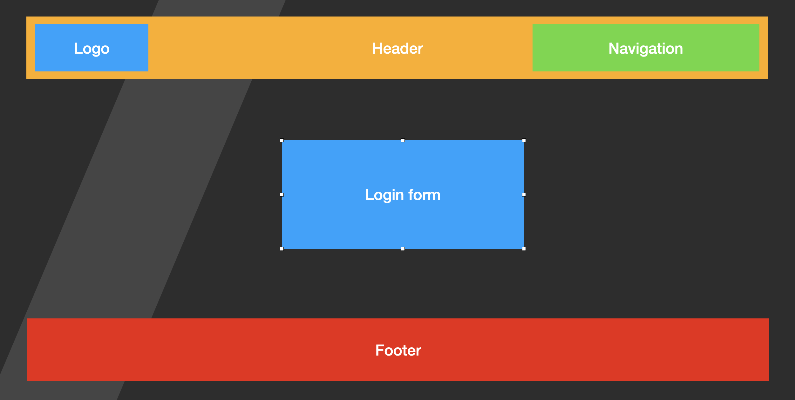

**React** is a library that helps you build user interface components for frontend apps.  

Using **React** you can build websites, desktop application, mobile apps, and more.

When creating your screen, for example creating a login page, that page consists of certain UI sections.  

React will help you build your page by giving you tools to create UI components from the UI sections in the page you want to create.  
In this login page you might have a `<Header />` component, a `<LoginForm />` component and a `<Footer />` component.  
React is a library that helps you build UI components, and update the appearance of those components when needed 

**React** is the most popular frontend library used today.  
In fact you probably visited many **React** websites without noticing...  
For example every time you watched something on [Netflix](https://www.netflix.com/), or booked accomodation using [Airbnb](http://airbnb.com/), these sites and many more are built with React.  

There are other popular frontend technologies like [Angular](https://angular.io/) and [Vue.js](https://link).  
A good indicator of popularity comparison between **React, Angular and Vue.js** is [NPM trends](https://www.npmtrends.com/react-vs-@angular/core-vs-vue) which allows us to track the number of download from NPM of those popular technologies just to show how popular React is against the leading competitors.

In fact due to this popularity there is a very high demand for **React** developers and **React** is one of the technologies that could really upgrade your market value as a developer.

In this course we will learn **React** by using it to build a website.  

Welcome to academeez React course.
