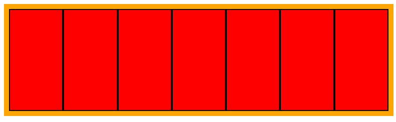

Let's try and examine how `Flexbox` position elements
on the screen.

When using `Flexbox` algorithm to arrange elements on the screen, we set an element in our DOM to be the `flex container`.

## Flex Container

The flex container will position his first degree children in the `Flexbox` algorithm.  
In the example [here](https://codesandbox.io/s/html-cssflexboxhow-flexbox-positioning-works-brie8?file=/index.html)

we have a div element that we set as our `flex container` by placing the following css rule:

```css
.flexbox-container {
  display: flex;  
}
```

The above rule will make all elements with the class `flexbox-container` to position the children in the `Flexbox` algorithm.

In our `index.html` we created the following `div`.

```html
<div class="flexbox-container">
</div>
```

## Flex Items

When you set an element to be a `Flex container` then the element direct children are called `Flex items` and they will be arranged according to the `Flexbox` algorithm.

In the following example we will set each `Flex item` to be a certain size and color, by doing so we can examine how `Flexbox` arranges those items.

```html
<div class="flexbox-container">
  <div class="flex-item"></div>
  <div class="flex-item"></div>
  <div class="flex-item"></div>
  <div class="flex-item"></div>
  <div class="flex-item"></div>
  <div class="flex-item"></div>
  <div class="flex-item"></div>
</div>
```

and let's add the following styles to those elements

```
.flexbox-container {
  display: flex;
  background-color: orange;
  padding: 10px;
}

.flex-item {
  height: 200px;
  width: 200px;
  background-color: red;
  border: 2px solid black;
}
```

Notice in the following example that we set the `flex container` to have an orange background.  
And the `Flex items` to have a certain size and a red background.

The result we got is this:



## Main Axis

To make things simple for now...  
`Flexbox` is a fancy way to say: `"Arranging item in a row"`  
Although that sentence is not 100% accurate, the **default** behaviour of `Flexbox` is arranging items in a row.  
That row is called the `Main Axis` and `Flexbox` will arrange the items along the `Main Axis` is a certain direction which by default is from left to right.  

By default Flexbox will fill the main axis from left to right, giving each item the same width.  
The width is set to `200px` but when the row is filled it will give each `Flex Item` and equal lower width so they can all fit in one row.

Let's dig a bit deeper on the **Main Axis** that is used to arrange the **Flex Items**

The full source code of the lesson is available [here](https://codesandbox.io/s/html-cssflexboxhow-flexbox-positioning-works-brie8?file=/index.html)

