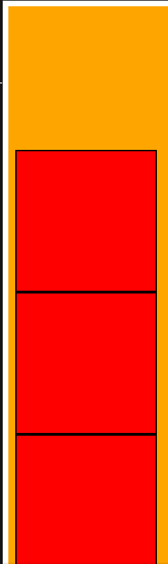

`Flexbox` will arrange the **Flex Items** on a row from left to right, but what actually happens the items are arranged on the **Main Axis** (by default is horizontal row) from the `flex-direction` (by default from left to right)

In this lesson we will further explore how axis and directions can impact the `Flexbox` element positioning.

## Main Axis

We saw in the [previous lesson](https://academeez.com/courses/html-css/flexbox/how-flexbox-positioning-works) that by default `Flexbox` will arrange the **Flex Items** in a row from left to right.  
But the horizontal direction is just the default **Main Axis** and can be changed.

Let's try to set the **Main Axis** to be vertical.  
The **Main Axis** can be controlled by setting in the css the  
`flex-direction: column;`  

The following HTML:

```html
<div class="flexbox-container">
  <div class="flex-item"></div>
  <div class="flex-item"></div>
  <div class="flex-item"></div>
</div>
```

With the following CSS:

```css
.flexbox-container {
  display: flex;
  background-color: orange;
  padding: 10px;
  flex-direction: column;
}

.flex-item {
  height: 200px;
  width: 200px;
  background-color: red;
  border: 2px solid black;
}
```

Will arrange the `.flex-item` div's vertically from top to bottom.  
You can view the full example [here](https://codesandbox.io/s/html-cssflexboxhow-main-axis-rz87p?file=/index.html)

## Flex Direction

In the `flex-direction` property you can also set the direction of which the **Flex Items** will be arranged.  

Try and change the CSS to this:

```CSS
body,
html {
  height: 100%;
}

.flexbox-container {
  display: flex;
  background-color: orange;
  padding: 10px;
  height: 100%;
  flex-direction: column-reverse;
}

.flex-item {
  height: 200px;
  width: 200px;
  background-color: red;
  border: 2px solid black;
}

```

In this example we set the `flex-direction: column-reverse` so the items will be arranged vertically but now from bottom to top.  
Example of this can be found [here](https://codesandbox.io/s/html-cssflexboxhow-main-axis-rz87p?file=/style-direction.css)



## Summary

`Flexbox` arrange the **Flex Items** along the main axis on a certain direction.  
You can control the main axis and direction using the `flex-direction` css property:

- `flex-direction: row` - this is the default, items are arranged horizontally from left to right
- `flex-direction: row-reverse` - Items will be arranged horizontally from right to left
- `flex-direction: column` - items will be arranged vertically from top to bottom
- `flex-direction: column-reverse` - items will be arranged vertically from bottom to top
