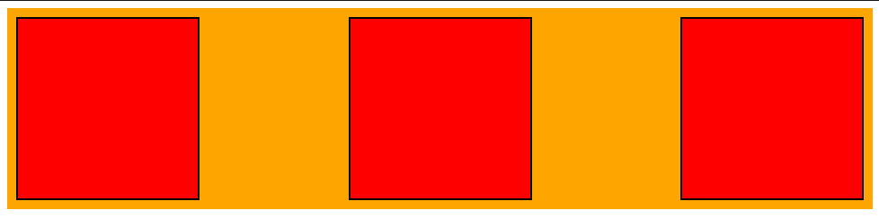
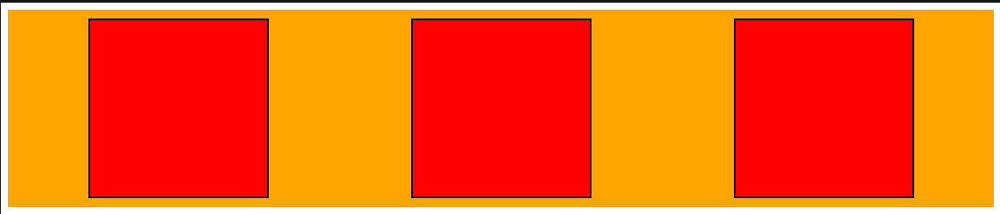
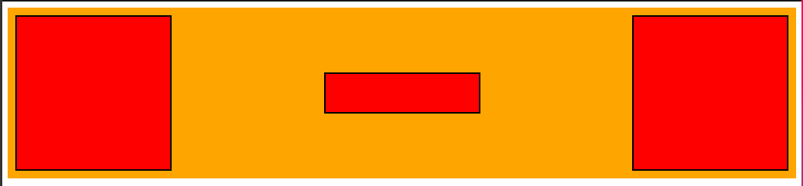

`Flexbox` will arrange the **Flex Items** according to the `flex-direction` css property.  
`flex-direction: row` or `flex-direction: row-reverse` will arrange the items horizontaly from left to right or from right to left.  
`flex-direction: column` or `flex-direction: column-reverse` will arrange the items from top to bottom or from bottom to top.  
What if we want to change how the **Flex Items** are distributed?  
There are a few css properties that will help us decide how to distribute the **Flex items** inside the **Flex container**.

## justify-content

Let's examine how we can distribute the **Flex items** differently.  
Given the following HTML structure:

```html
<div class="flexbox-container">
  <div class="flex-item"></div>
  <div class="flex-item"></div>
  <div class="flex-item"></div>
</div>
```

we noticed that by default the items will be arranged from left to right.  
Let's modify the CSS a bit:

```css
.flexbox-container {
  display: flex;
  background-color: orange;
  padding: 10px;
  justify-content: space-between;
}

.flex-item {
  height: 200px;
  width: 200px;
  background-color: red;
  border: 2px solid black;
}
```

Notice that we placed on the `.flexbox-container` the css property: `justify-content: space-between`.  
After doing so we get a different distribution of the `.flex-item`'s along the main horizontal axis.  
This is the result:



The `space-between` will distribute the  `.flex-item`'s evenly across the `.flex-container`.

You can view the code example [here]()

So the `justify-content` css property, defines how the browser distribute the space between and and around the **Flex Items**

Here are a few more examples of the values you can set `justify-content`:

- `justify-content: left/right` - Will behave differently on firefox and on chrome.  
On Firefox these options will disregard the `flex-direction` and will arrange them on the left/right/center of the flex container regardless of the `flex-direction` value. While it will behave similar to `flex-start/flex-end` on Chrome (at the time of writing it is recommended to use `flex-start/flex-end`).

- `justify-content: center` - will arrange the **Flex Items** on the center of the container.


- `justify-content: space-around` - even space between the **Flex Items** including even space at the start and end.



- `justify-content: space-between` - even space without space at the start and end.

## Cross Axis

The main axis is determined by the `flex-direction` css property as we saw on the [Previous Lesson](https://academeez.com/courses/html-css/flexbox/main-axis).  
In `Flexbox` we always have the **Main Axis** and the axis perpendicular to it is the **Cross Axis**

## align-items

Using the `align-items` property you can control the position of the **Flex items** along the **Cross Axis**.

In the following example one **Flex Item** is smaller then the rest.

```html
<div class="flexbox-container">
  <div class="flex-item"></div>
  <div class="flex-item flex-item-small"></div>
  <div class="flex-item"></div>
</div>
```

```css
.flexbox-container {
  display: flex;
  background-color: orange;
  padding: 10px;
  justify-content: space-between;
  align-items: center;
}

.flex-item {
  height: 200px;
  width: 200px;
  background-color: red;
  border: 2px solid black;
}

.flex-item.flex-item-small {
  height: 50px;
}
```

Notice that when we placed the `align-items: center` of the **Flexbox Container** it placed the smaller **Flex Item** at the center of the container.



Before `Flexbox` positioning elements on the horizontal center and vertical center was a bit problematic and often involved using `absolute` positioning.  
With `Flexbox` `justify-content` and `align-items` we can now center elements vertically and horizontally in their container.

Other `align-items` options are:

- `align-items: start/end/flex-start/flex-end` - due to a change in the [W3 Flexbox module 1](https://www.w3.org/TR/css-flexbox-1/) at the time of writing it's recommended to use `flex-start/flex-end` the other have different behaviour on Chrome/Firefox.  
It will arrange the items at the top or bottom of the cross axis

## Summary

`Flexbox` arrange the **Flex Items** inside the **Flex Container**.  
We can decide how those elements will be distributed across the **Main Axis** and **Cross Axis**.  
Using the `justify-content` we can set how elements are distributed across the **Main Axis**.  
Using the `align-items` we can set how elements are distributed in the **Cross Axis**

