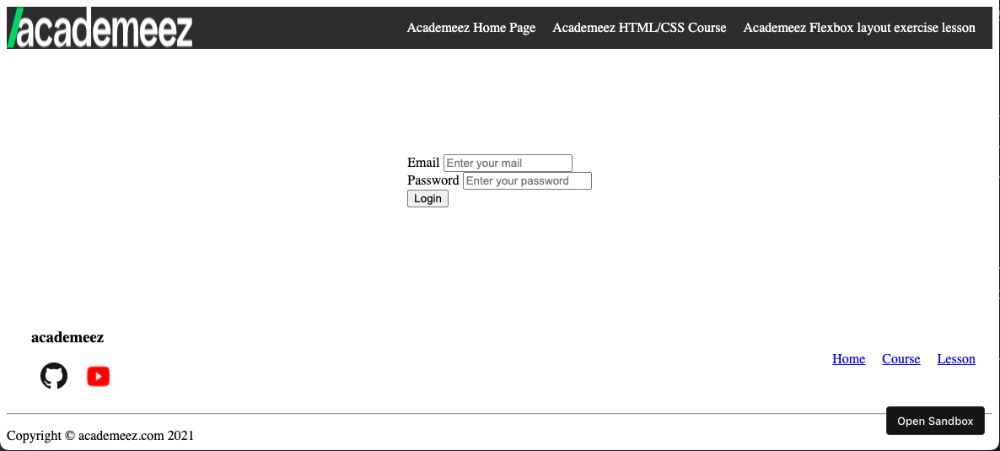

Writing code is the only way to properly learn.  
Time for you coders to practice flexbox.  
The goal of this exercise is for you to build and entire layout using `Flexbox`.  

## What we will create

In this exercise we will create the following layout:

You will need to create an `index.html` and a `style.css` files.  
You will need to build a full login page.  

### Header

The login page contains a header with an image on the left side and a navigation bar on the right side.  
You can add any image you want on the left side.  
use `Flexbox` and `justify-content` to position the logo on one side and the navigation on the other.

### Login

The login page contains a login form with an email input, a password input, and a submit button.  
Notice that the login form is centered vertically and horizontally.  
You will have to use `justify-content` and `align-items` to achieve that.  

### Footer

The footer will be located at the bottom of the page.  
It contains left side links with images and a title, and right side links.  
Notice that the right side links are vertically centered with the left side links.  
You will have to use `align-items` to achieve that effect.  
`
` will seperate that section and will place a copyright text at the bottom.

The solution for this exercise is located [here](https://codesandbox.io/s/html-css-flexbox-layout-exercise-eo3th?file=/index.html:2397-2414)
