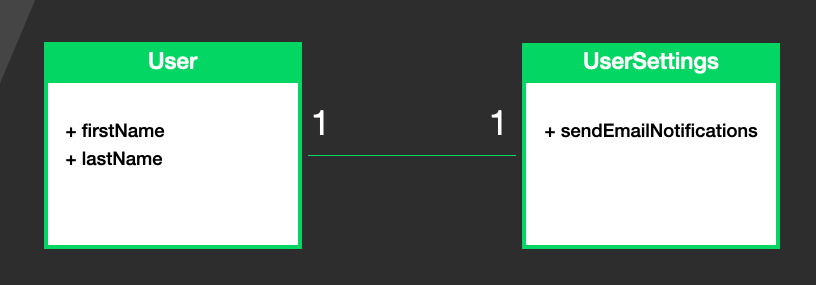
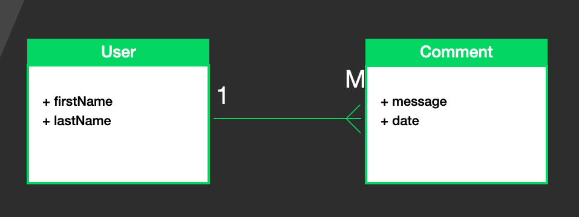
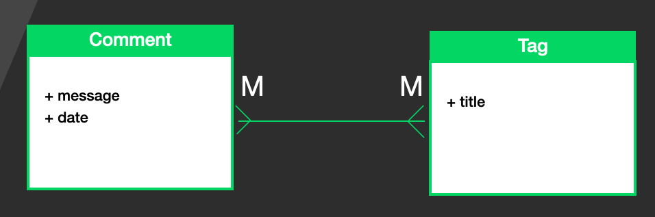

Before choosing which database should I use, NoSQL or SQL, it's highly recommended to do a bit of planning. By looking at the screens of the application you are trying to create, try to understand the entities or tables (collections in NoSQL) you will have in your app. Write down those entities (tables) along with the columns each table will have. After doing that, try to realise the relationship between the entities. There are different kind of relationships entities can have, let's review them.

## One to One / 1-1

In this relationship, a row in table A is connected to a row in table B



For example we might have a table called `Users` where each row represents a registered user in our app.  
We might have another table in our database called `UserSettings` which holds the app settings for a registered user.  
One user in our app has one UserSetting, which means those tables are connected in a one to one relationship.
In SQL relational databases, this connection will be represented by a column in one of the tables: `User`, `UserSettings` which holds a reference to the other table.
Usually that reference is done with the `primary key` field, the `primary key` is a unique value identifying a row. In relational databases that key is usually a number starting with 1 on the first row and incremented on each row. In `mongo` the primary key is a unique hash called `ObjectId`.
So to represent the `one to one` relationship, our `UserSettings` table can have a column called `userId` where every row of the `UserSettings` has the `primary key` of the row from the `User` table it is connected to.

The `userId` column is how you would represent this relationship in a relational database, in a NoSQL database like mongo there are plenty of ways to represent this connection, where the popular one will be, to not create a `UserSettings` collection at all and simply storing the `UserSettings` in the `Users` collection.  
So a document in the Users collection might look like this:

```javascript
{
    firstName: 'Hello',
    lastName: 'World',
    userSettings: {
        sendEmailNotifications: true
    }
}
```

Remember that the documents in NoSQL can have nested json objects inside.

## One to Many / 1-M

In this relationship table A is connected to many rows in table B



For example a single registered user might have plenty of comments he published. This kind of relationship in SQL relational databases is represented with a column `userId` in the comments table, so every row of comment will contain the primary key of the user that published that comment.

This kind of relationship in a NoSQL database can be defined in an infinite amount of ways.
I guess this is the challenge of NoSQL there is no one way fits all solution like in the SQL database for dealing with this relationship, the way you handle it is very much depends on the queries you will preform on the tables, but more on that later on.
One way to define this relationship in a NoSQL will be:

```javascript
{
    firstName: "Hello",
    lastName: "World",
    comments: [
        {
            message: "foo",
            date: "2020-05-19T18:49:50.580Z"
        },
        {
          message: "bar",
          date: "2020-05-19T18:49:50.580Z"
      }
    ]
}
```

Remember that a NoSQL document can contain array of objects, so in NoSQL the two tables `User` and `Comments` can turn to one table.

## Many to Many / M-M

In this relationship many rows of table A are connected to many rows in table B.
Let's say we can place tags in each comment.



a comment can have many tags, and each tag can refer to many comments.

In an SQL database, this kind of relationship is achieved by creating two tables, one for `Comment` and one for `Tag`, and also creating a third table that are connecting the tags and the comments, we can call that table `CommentTag`.

Let's say we have a tag called `Lessons`, and the `primary key` (`pk`) of that tag is `1`, and we have 2 comments this tag is associated with, comment with `pk` `2` and `3`, than the `CommentTag` table will have a column for `pk` of tags and a column for `pk` of comments, and the `CommentTag` will have these rows:

| id  | commentId | tagId |
| --- | :-------: | ----: |
| 1   |     2     |     1 |
| 2   |     3     |     1 |

This is how this relationship is achieved in a SQL table, with another table connecting the two tables.

In a NoSQL db there is yet again infinite amounts of ways to achieve this relationship.
One of these ways can say we are placing in the comments array of pk of the tags they are connected to.  
Like so:

```javascript
{
  _id: ObjectId("345dasdfxcv2432"),
  message: "foo",
  date: "2020-05-19T18:49:50.580Z",
  tags: [
    ObjectId("5ec41d2e564e803a0d8e4ec3"),
    ObjectId("5vb41d2e564e803a0de4sdc4")
  ]
}
```

and the tags can also hold array of the comments they are connected to:

```javascript
{
  _id: ObjectId("5ec41d2e564e803a0d8e4ec3"),
  title: "Lessons",
  comments: [
    ObjectId("345dasdfxcv2432")
  ]
}
```

So the first step I take before starting to deal with the database is understanding the table (or collections) I have, and understanding the relationships between those entities.  
After doing that I need to try to figure out the queries I have...
