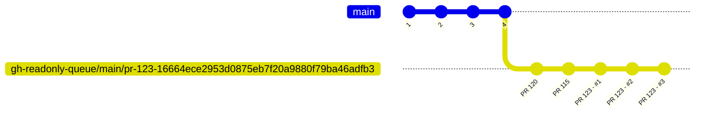
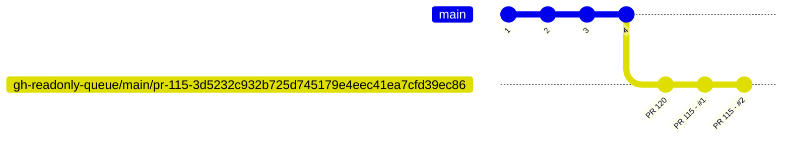
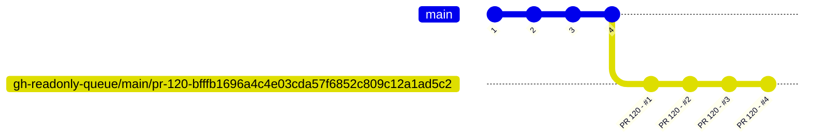
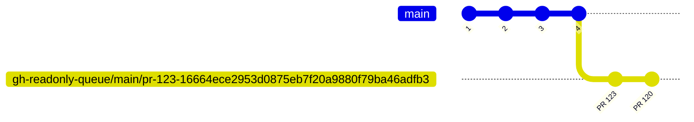
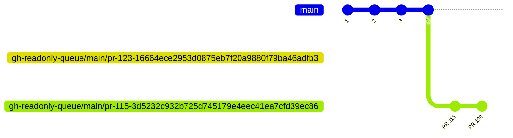
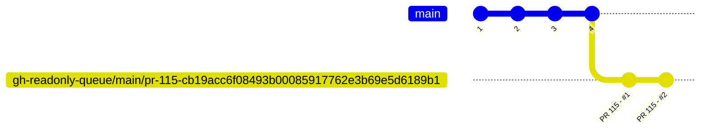
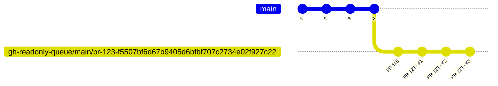

[Merge Queue](https://docs.github.com/en/repositories/configuring-branches-and-merges-in-your-repository/configuring-pull-request-merges/managing-a-merge-queue) helps you manage and merge automatically a queue of PRs. 
It automatically merges your PR when the required checks and workflows pass. 
It runs those checks and workflows while upholding the branch ruleset setting **Require branches to be up to date before merging**. 
It solves the problem of developers having to go to the PR page when `main` is changing, rebase their branch with the latest main, and run the checks again.
Crucial component when managing team of developers that are frequently creating PRs to the same branch.

A healthy software project relies on a clear, enforced development process supported by automated checks and tests that validate code quality and ensure the team follows the agreed workflow.
This is the job of your CI — it’s like the strict sergeant who makes sure everyone stays in line and follows the rules.
After your CI sergeant gives approval, you can take it a step further by automatically merging the code and releasing a new version—that's the CD (Continuous Deployment) process.
In this course, our CI sergeant is GitHub Actions. Since we're automatically releasing updates when CI checks pass, we should make this process as accurate and reliable as possible.

## Ruleset - Protecting the Release Branch

Merge Queue will target certain branches usually branches that have large amount
of PR's from different developers that wants to merge code to them.
In our course we will have a single special branch which is `main` which will function as our release branch.
Everything that will be pushed to that branch will eventually reach production.
This means that CI automations and checks must protect that branch and ensure high-quality code, since everything pushed to that branch will be released to production.
Certain rules regarding that branch needs to be enforced, we can't just let any developer push code to that branch without enforcing the quality of his
code.

To enforce restrictions on the main branch, navigate to the repository settings, expand the rules section, and click **Rulesets** (in most cases, it's best to use the new branch rulesets over the older branch protection rules).
Click the green **New ruleset** button and on the menu that pops choose **New branch ruleset**.
We are not going to go over each and every option here, but let's emphasize a few of the important ones that relate to the topic of this lesson: 

1. **Target branches** - Make sure the rules apply to the branch you want to protect. In this course, we are protecting the **main** branch, which is the **Default** branch.
2. **Require a pull request before merging** - This means we cannot push directly to the `main` branch. Instead, we must create a [pull request](https://docs.github.com/en/pull-requests) to suggest changes, get approval from reviewers, and pass the checks and tests. This option has additional suboptions:
   2.1. **Required approvals** - We will set this to one to verify that each pull request is reviewed by another developer.
   2.2. **Allowed merge methods** - We recommend keeping just a single option: **Squash**.
3. **Require status checks to pass** - This ensures that a PR can only be merged if it passes the required checks. This option also expands:
   3.1. **Require branches to be up to date before merging**
   3.2. **Add checks** - We will later add checks that are required for the pull request to pass before it can be merged.
4. **Block force pushes**

Our **main** branch is better protected now, but these rules can introduce a new problem—one that a merge queue can help us solve.

## The PR Race Condition

To enforce CI on every pull request, we enabled **Require status checks to pass**.
We also enabled **Require branches to be up to date before merging**.

It’s not enough for checks to pass on your PR branch in isolation—they need to pass when your PR is tested against the latest `main`.
For example, imagine your PR and another developer’s PR both pass the test suite on their own. If the other PR merges first, the *combined* code (their changes + yours) might cause tests to fail. In other words: each PR is “green” alone, but together they introduce a bug.

That’s why we enabled **Require branches to be up to date before merging**: it forces your PR to rebase/merge the latest `main` and run the checks again before it can be merged, keeping CI results accurate and reliable.

The problem starts in a busy repo, where a team creates multiple PRs every day and everyone is trying to merge while still complying with **Require branches to be up to date before merging**.
At peak times, CI ends up running many checks in parallel across several PRs.

Each developer has to wait for checks to finish before merging their code. But while they’re waiting, another PR merges and pushes new commits to `main`.
Now their PR is no longer up to date, so they need to bring in the latest `main` and run the checks again—from scratch.
And while they wait again, yet another PR might merge, forcing the same cycle one more time.

This creates a race where developers keep rebasing and re-running CI just to stay mergeable. It wastes time, and some PRs can even get “starved”, staying pending for a long time.

## Demo: The PR Race Condition

A demo of the problem is available in the [github-merge-queue repository](https://github.com/Nerdeez/github-merge-queue).
This repository contains 2 workflows in [.github/workflows](https://github.com/Nerdeez/github-merge-queue/tree/main/.github/workflows).
The `build.yaml` workflow runs on every PR and simulates the build process (represented by a 3-minute sleep).
After the build finishes, it triggers the `test.yaml` workflow, which simulates the tests that run on the build result (also represented by a 3-minute sleep).
The `build.yaml` workflow looks like this:

```yaml title=".github/workflows/build.yaml"
#
# simulates a build workflow
# this workflow will run when a pull request is created
# it will sleep for a period of time and then pass or fail based on the content of the build.result.txt file.
# if there is no build.result.txt file, the workflow will pass.
#

name: Build

on:
  pull_request:
    types: [opened, synchronize, reopened]
  # we will talk about this trigger later on in this lesson
  merge_group:

jobs:
  build:
    runs-on: ubuntu-slim
    steps:
      - name: Checkout code
        uses: actions/checkout@v6.0.2

      - name: Sleep for 3 minutes
        run: sleep 180

      - name: Check build result
        id: check_result
        run: |
          if [ -f build.result.txt ]; then
            RESULT=$(cat build.result.txt | tr -d '[:space:]')
            echo "result=$RESULT" >> $GITHUB_OUTPUT
          else
            echo "result=pass" >> $GITHUB_OUTPUT
          fi

      - name: Pass or fail based on result
        run: |
          if [ "${{ steps.check_result.outputs.result }}" = "fail" ]; then
            echo "Build failed based on build.result.txt content"
            exit 1
          else
            echo "Build passed"
          fi

      - name: Call test workflow
        if: success()
        uses: actions/github-script@v8
        with:
          script: |
            const ref = context.payload.pull_request
              ? context.payload.pull_request.head.ref
              : context.ref;

            await github.rest.actions.createWorkflowDispatch({
              owner: context.repo.owner,
              repo: context.repo.repo,
              workflow_id: 'test.yaml',
              ref: ref,
              inputs: {
                commit_sha: context.sha
              }
            });
```

It checks out the code and, based on the content of the `build.result.txt` file, will fail if the file contains `fail`.
Upon success, it triggers the `test.yaml` workflow.

The `test.yaml` workflow looks like this:

```yaml title=".github/workflows/build.yaml"
#
# the build workflow will call this workflow with the commit sha of the head commit of the pr.
# it will check the test.result.txt file to determine if the test passed or failed.
# it will create a check on head commit of the pr with the result.
#

name: Test

on:
  workflow_dispatch:
    inputs:
      commit_sha:
        description: 'The commit SHA to test'
        required: true
        type: string

jobs:
  test:
    runs-on: ubuntu-slim
    steps:
      - name: Checkout code
        uses: actions/checkout@v6.0.2
        with:
          ref: ${{ inputs.commit_sha }}

      - name: Create check run
        id: create_check
        uses: actions/github-script@v8
        with:
          script: |
            const { data: checkRun } = await github.rest.checks.create({
              owner: context.repo.owner,
              repo: context.repo.repo,
              name: 'E2E Check',
              head_sha: context.payload.inputs.commit_sha,
              status: 'in_progress',
              output: {
                title: 'Test is running',
                summary: 'Test workflow is executing'
              }
            });
            
            core.setOutput('check_run_id', checkRun.id);

      - name: Sleep for 3 minutes
        run: sleep 180

      - name: Check test result
        id: check_result
        run: |
          if [ -f test.result.txt ]; then
            RESULT=$(cat test.result.txt | tr -d '[:space:]')
            echo "result=$RESULT" >> $GITHUB_OUTPUT
          else
            echo "result=pass" >> $GITHUB_OUTPUT
          fi

      - name: Update check run with result
        uses: actions/github-script@v8
        with:
          script: |
            const result = '${{ steps.check_result.outputs.result }}';
            const conclusion = result === 'fail' ? 'failure' : 'success';
            const title = result === 'fail' ? 'Test failed' : 'Test passed';
            const summary = result === 'fail' 
              ? 'Test failed based on test.result.txt content'
              : 'Test passed successfully';
            
            await github.rest.checks.update({
              owner: context.repo.owner,
              repo: context.repo.repo,
              check_run_id: ${{ steps.create_check.outputs.check_run_id }},
              status: 'completed',
              conclusion: conclusion,
              output: {
                title: title,
                summary: summary
              }
            });

      - name: Pass or fail based on result
        run: |
          if [ "${{ steps.check_result.outputs.result }}" = "fail" ]; then
            echo "Test failed based on test.result.txt content"
            exit 1
          else
            echo "Test passed"
          fi
```

The test workflow is triggered after the build finishes successfully.
It creates a check, sleeps for 3 minutes, determines the test result based on the `test.result.txt` file, and updates the check accordingly.

Let's imagine two developers working on that repository.
Developer A pushes their PR at 12:00.
Developer B pushes their PR at 12:01.
Developer A's checks finish at 12:06, but they're on their lunch break.
Developer B merges their PR at 12:07.
Developer A needs to rebase their branch with `main` and run the checks again (because we enabled the ruleset option **Require branches to be up to date before merging**).
Developer A finish lunch at 13:00 only to discover they need to restart the checks.
That's one hour of delay—time when their PR could have already been running in production.

This might seem like a minor problem, but multiply it by 20 developers and you'll quickly get frustrated. You'll start seeing messages in Slack like: `Everybody please do not merge your PR's I need to push something...`
More importantly, developers waste a lot of time babysitting their PR checks.

## Merge Queue

The way we will solve the presented problem is by using GitHub Merge Queue.
First let's look at a very high level how Developer A and Developer B would interact with the merge queue after it is enabled.

### Merge Queue High Level Overview

After Merge Queue is enabled this is how Developer A and Developer B would interact with the merge queue and merge their PRs.

Developer A pushes their PR at 12:00. Immediately, they navigate to the PR page and are presented with this option:


They don't have to wait for the checks to finish—they can schedule the PR to be merged automatically by clicking **Merge when ready**. When all the requirements for the PR have passed, their work is transitioned to the merge queue, where the checks will be run again (not necessarily right away, but eventually). If the checks pass successfully in the merge queue, the PR will be merged automatically.
The order of the merge is determined by the Merge Queue, it might get merged after another PR of another developer.

At 12:01, Developer B pushes their PR and also clicks **Merge when ready**. This means Developer A's PR will finish its initial checks at 12:06 (and be transferred to the merge queue), while Developer B's PR will finish running all checks around 12:07 (and also be transferred to the merge queue). Developer B's work will enter the queue after Developer A's PR.
The checks will run again in the Merge Queue, and it could run in parallel for developer A and developer B
so the checks can run in parallel but the actual merge order the queue will maintain and if developer A's PR is the first in line it will be merged first.
Even though developer A's PR was merged first it did not require developer B to do anything with his PR, before we enabled merge queue developer B had to rebase his PR with the latest main and run the checks again before he can merge his PR.

## Enable Merge Queue

We talked about different options in the **Settings** -> **Rules** --> **Rulesets** where we can protect and set rules for our main branch.
In that same place you can enable **Merge Queue** and set options for it.
However there is a chance that you won't see it there, the reason is that **Merge Queue** is only available for:

:::note
Pull request merge queues are available in any public repository owned by an organization, or in private repositories owned by organizations using GitHub Enterprise Cloud.
:::

## How merge queue works

Let's try to be a bit more technical and understand exactly how the merge queue works.
To undertstand this let's define a concept called a merge group.

### Merge Group

Our merge queue is a queue of the order of PR's that needs to be merged.
So if PR with ID `#123` is pushed to the queue before PR with ID `#120` the order of the merge is set to first merge PR with ID `#123` and then PR with ID `#120`.
So in this case we have 2 PR's in the queue and those PR's might generate one or two merge groups.
If we have 3 PR's in the queue, there can be 1-3 merge groups created for them (depends on the Merge Queue settings that we will discuss later on in this lesson).

So what is a **Merge Group**?
A merge group represents one or more PR's that are grouped in a single branch, and checks and workflows will be run on that branch - and those PR's will be merged in the same order as they are in the merge group.
A merge group is represented by a branch, that branch is not exactly a regular branch in the sense that it is a readonly branch that is created and managed by github merge queue.
The name of the branch looks like this: `gh-readonly-queue/main/pr-<prId>-<ref head sha>` (if there is more than one PR to merge in that group the `prId` will be the first PR in the group)
It contains the pr id as well as the head sha in the readonly branch.
This is a mistake I made so I feel like I need to emphasize this point: The `HEAD` of the PR branch is not the same as the `HEAD` of the merge group branch.
The branch that is created is aligned with the main branch and it will also contain other merge groups that created before the current merge group.

Let's examine a simple example of merge group where each merge group represents a single PR.
So you created a PR with ID `123`, and you clicked the **Merge when ready** button, and your PR passed all the checks, so there will be a merge group branch created with the name `gh-readonly-queue/main/pr-123-<sha>`.
2 developers also created PR's with ID's `120` and `115` and a merge group was created for each of those PR's.
The branch of your merge group might look like the following:

<div class="not-content">

</div>

Notice that we represented each PR before my PR as a single commit, if it's a single commit or merge commit or rebase of the commits in the PR depends on the ruleset setting: **Merge method**, which we will discuss later on in this lesson.

PR 115 that was pushed before will also have a branch created for him which might look like the following:
<div class="not-content">

</div>

And the first PR that was pushed will also have a branch created for him which might look like the following:
<div class="not-content">

</div>

After these branches are created, the checks are run on each of the branches, and they can actually run in parallel depending on **Build concurrency** setting.
Now if everyone is passing the checks the merge queue will automatically merge the changes in the order of the queue, so first PR 120 will be merged, then PR 115 and finally PR 123.
Let's cover different scenarios that can happen other than the happy path.

### Scenario 1: Merge Group can contain more than one PR

In the settings you have a bit more control over the merge group size, for example you can say i want a single merge group branch created
for 2 PR's.
Now let's say the following PR's are in the queue:
- PR 123
- PR 120
- PR 115
- PR 100


we will have 1 branch called `gh-readonly-queue/main/pr-123-16664ece2953d0875eb7f20a9880f79ba46adfb3` and it will contain the commits of PR 123, PR 120.
we will have 1 branch called `gh-readonly-queue/main/pr-115-3d5232c932b725d745179e4eec41ea7cfd39ec86` and it will contain the commits of PR 115 and PR 100.

the checks and workflows will run on those branches and they might look like this:
<div class="not-content">

</div>

and the other branch might look like this:
<div class="not-content">

</div>

### Scenario 1: PR 120 fails checks

If one of the merge groups before the merge group that my PR is in fails the checks, it will be removed from the merge queue, and all the merge groups after the failing merge group will have to be recreated without
the failing merge group, and the checks will have to rerun on the new merge groups.
So in our example of a merge group for each PR, if PR 120 is failing the checks it will be removed from the merge queue, the other 2 merge groups will be recreated and might look like this:

<div class="not-content">

</div>

This is the merge group for PR 115 what is now first in the queue.

The merge group for PR 123 will also be recreated and might look like this:
<div class="not-content">

</div>

Notice how also the sha of the merge group is different, this is because the merge group is recreated without the failing PR.

### Scenario 2: Conflicts

We turned on the **Require branches to be up to date before merging** option in the ruleset, which means before our PR can even enter the merge queue
we have to make sure that our PR is up to date with the main branch, and that the checks pass after the rebase.
So we know that our branch cannot have conflicts with the main branch when it enters the merge queue.
But what happens if there are conflicts with one of the PR's before mine?
What happens if PR 123 and PR 115 have conflicts with each other?
Obviously creating the merge group of PR 115 is not a problem cause it doesn't even include PR 123 on the merge group branch.
But when the merge group is created for PR 123 it will include PR 115 before and it might cause a conflict.
In that case you will see this error in the merge queue:


You will have to resolve the conflicts by either waiting for the first PR to finish and solve the conflicts with main.
or rebase your PR branch manually on the PR and solve the conflicts with the first PR.

### Scenario 3: Manual queue changes

After your PR will enter the merge queue, you will have a link in the PR page to view the merge queue under the url: `https://github.com/<org>/<repo>/queue/test/merge-queue`
In there you will have the option to view the checks of each merge group and also jump certain PR  to be the first in line.
Jumping will require additional confirmation since it will change the order of the queue and affect the check runs of every merge group in the queue.
Same goes for removing PR from the queue, this will also cause the merge groups after that PR in the queue to be recreated and the checks will have to rerun on the new merge groups.

### Scenario 4: Push changes to a PR that is in the queue

As we mentioned before, the merge group branch that is created for your PR is readonly, this means that you cannot push changes to it.
But what about your PR branch?
When the PR is in the queue you cannot push changes to the PR branch, any push will be declined, if you want to change the PR while that PR is in the merge queue
You will have to remove the PR from the queue and then push the changes to the PR branch.

## Merge Queue Settings

Let's enter the ruleset settings and see the options for the merge queue.


We will have to enable the **Require merge queue** option, and we can open the collapsable of that option for the following options:
- **Merge method** - This will determine how the merge group branch will be created - It is recommended that this setting will be equal to one of
the options you choose in **Allowed merge methods** (under the collapsable of **Require a pull request before merging**).
A good value that I recommend to choose there is to only allow **Squash** merge method, and adapt the **Merge method** to the option **Squash and merge**.
Using **Squash and merge** will create merge group branches like the example in this lesson where every PR before you in the queue will be represented by 
a single commit.
For the other options **Merge commit** will also include a single commit for each PR but it will be a merge commit, and **Rebase and merge** will spread all the commits of the PR's before yours.
- **Build concurrency** - Each merge group does not have to wait for other merege groups to finish, it can run the checks and the workflows together with the PR's before me in the queue.
It will not merge until the ones before me merge, but it can run the workflow and checks.
So the checks and workflows in the queue will run in parallel, and this setting will determine what is the maximum number of parallel merge groups that can run.
This setting is a trade of of the speed, price and flakiness of the checks.
If i set the **Build concurrency** to 5 this means that the first 5 merge groups in the queue can run the workflows in parallel, if number 2 in line fails it will need
to remove the second merge group and remove that PR from the queue and rebuild the merge group branch of the 3 after it, but if we set the **Build concurrency** to 3 it will only
stop the execution of a single merge group.
But if i set to 3 it will take longer for 5 merge groups to finish, I would say if you have more percentage of flakiness don't keep it soo high,
perhaps 3 is enough, but if you have less flakiness you can set it to 5 or even more if you have a large team with frequent PR's.
- 

## downsides of merge queue


## other solutions

