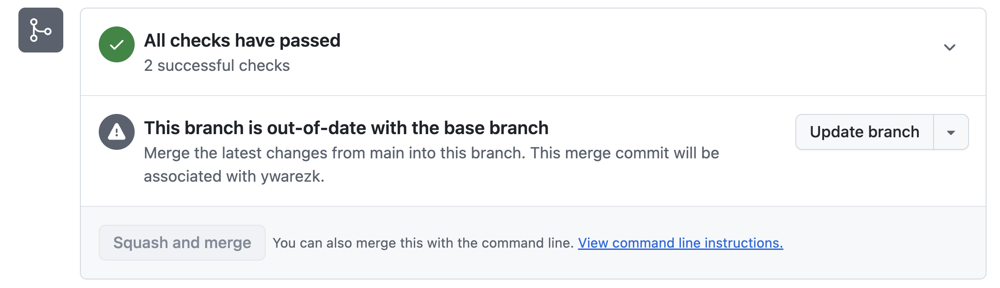
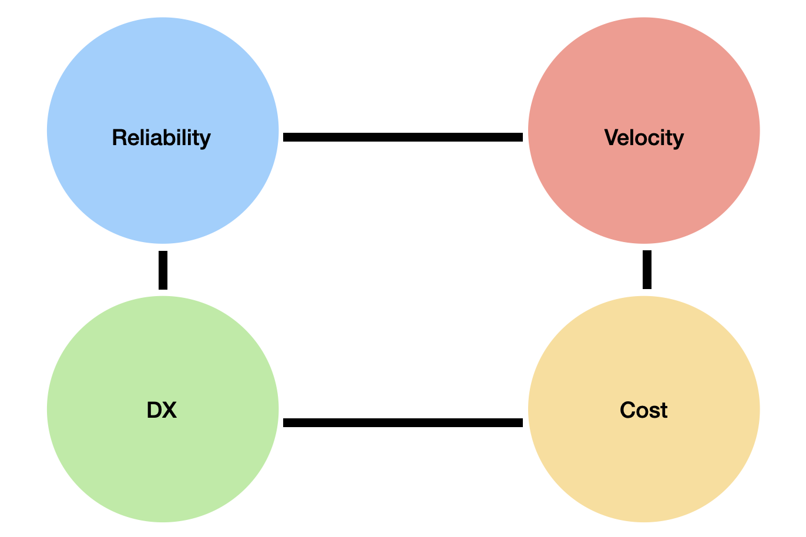
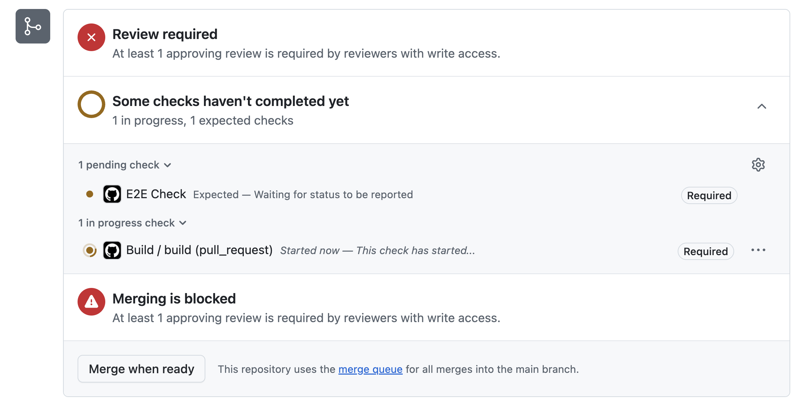
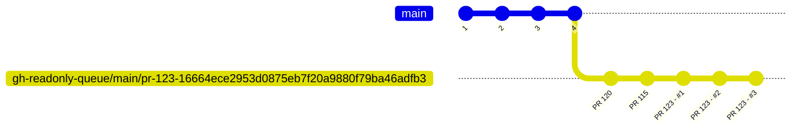
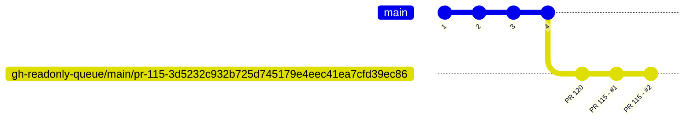
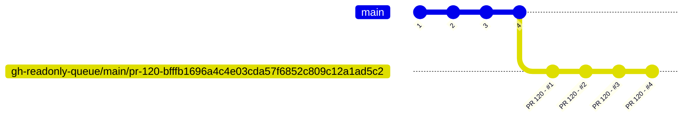
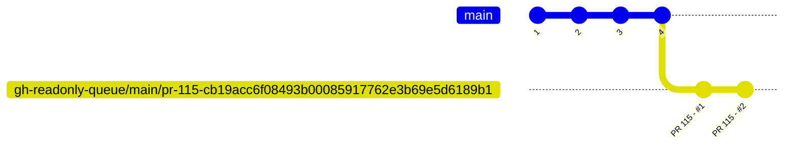
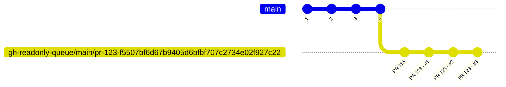
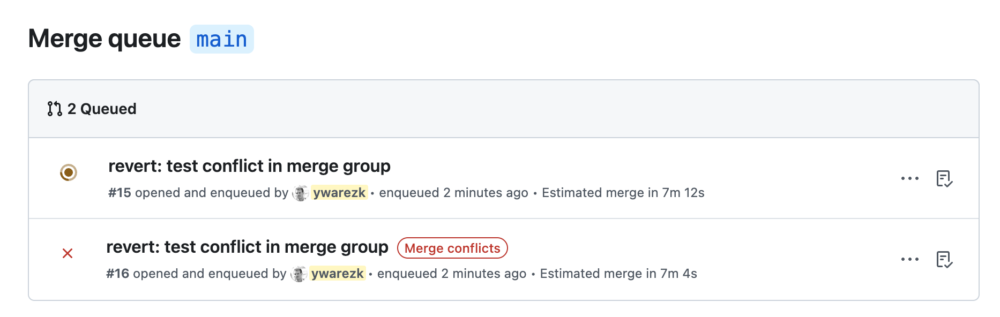
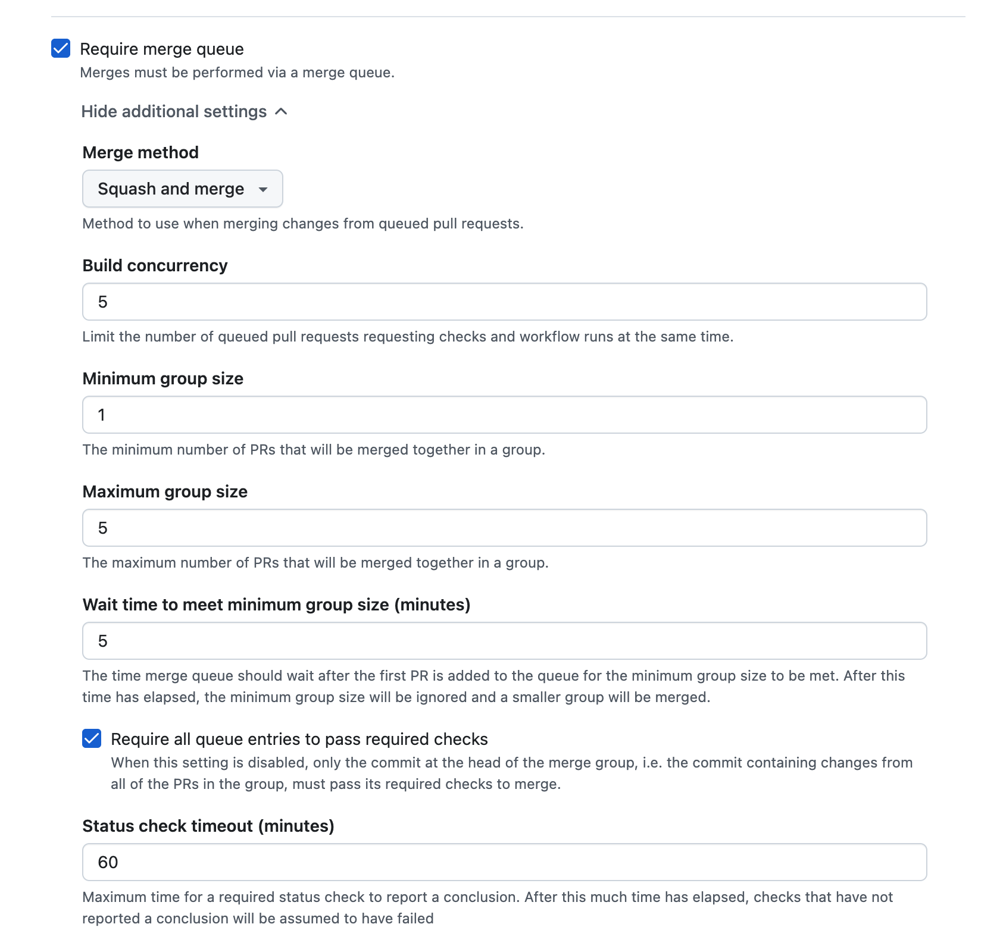

Let's start by describing the problem that merge queue can help you solve...  
The problem happens when a team of developers are opening PRs trying
to merge their code to the `main` branch.
If that `main` branch receives multiple updates every day, you might stumble on this problem which delays you from merging your PR:
<br/>


<br/>

Even though the checks on your PR passed, you still can’t merge to `main`.
Another developer has already merged their code to `main`, so your checks ran against an older version of `main`.
Now you have to rebase your PR onto the latest `main` and run the checks again—and if someone else merges after that, you may have to repeat this cycle again and again.
This wastes a lot of developer time babysitting PRs and burns unnecessary CI compute running the same checks over and over.

[Merge Queue](https://docs.github.com/en/repositories/configuring-branches-and-merges-in-your-repository/configuring-pull-request-merges/managing-a-merge-queue) can help you solve the issue. Merge queue will manage and merge automatically a queue of PRs. 
It automatically merges your PR when the required checks and workflows pass. 
It runs those checks and workflows while upholding the branch ruleset setting **Require branches to be up to date before merging**. 
It solves the problem of developers having to go to the PR page when `main` is changing, rebase their branch with the latest main, and run the checks again.

Merge queue is a crucial component when managing team of developers that are frequently creating PRs to the same branch.

## Merge code and CI quality: reliability, velocity, cost, and DX

Our goal is to ship reliable code: code that moves the product forward, fixes bugs, and introduces fewer and less severe new bugs.
To do that, we run checks on every change before it can be merged.
In this course we use [GitHub Actions](https://github.com/features/actions) as our CI to perform those checks.

We measure the quality of a CI system and merge flow by four pillars:



- **Reliability** — Do our tests catch real bugs? Do we have flaky tests or false positives? Are we testing in an environment similar to production? Which browsers and configurations do we cover? These questions determine whether the code we ship actually improves the product for our users.
- **Velocity** — How long do developers wait for checks to finish on their code before they can merge?
- **Cost** — Every CI run uses compute time (runners, minutes, infrastructure), which translates directly into cost.
- **DX (developer experience)** — When checks block a merge (e.g. a failing E2E test), developers need clear logs, easy debugging, and tooling to detect and fix the problems in his code.

These pillars influence each other. For example, if your E2E tests run on Chrome, you might improve reliability by adding Firefox—but that increases CI cost and can slow down velocity.
Nothing here is perfect; you’ll need to make tradeoffs, and what matters most can change as your team and product evolve.

## Increase Reliability - Ruleset - Protecting the special Branches

Merge Queue will target certain branches usually branches that have large amount
of PR's from different developers that wants to merge code to them.
In our course we will have a single special branch which is `main` which will function as our release branch.
Everything that will be pushed to that branch will eventually reach production.
This means that CI automations and checks must protect that branch and ensure high-quality code, since everything pushed to that branch will be released to production.
Certain rules regarding that branch needs to be enforced, we can't just let any developer push code to that branch without enforcing the quality of his
code.

To enforce restrictions on the main branch, configure a ruleset:

1. Go to your repository on GitHub and open **Settings**.
2. In the left sidebar, expand **Rules** and click **Rulesets** (prefer rulesets over the older branch protection rules).
3. Click the green **New ruleset** button, then choose **New branch ruleset** from the menu.

We won't go over every option, but here are the ones most relevant to this lesson: 

1. **Target branches** - Make sure the rules apply to the branch you want to protect. In this course, we are protecting the `main` branch, which is the **Default** branch.
2. **Require a pull request before merging** - This means we cannot push directly to the `main` branch. Instead, we must create a [pull request](https://docs.github.com/en/pull-requests) to suggest changes, get approval from reviewers, and pass the checks and tests. This option has additional suboptions:

   - 2.1. **Required approvals** - We will set this to one to verify that each pull request is reviewed by another developer.
   - 2.2. **Allowed merge methods** - We recommend keeping just a single option: **Squash**.

3. **Require status checks to pass** - This ensures that a PR can only be merged if it passes the required checks. This option also expands:

   - 3.1. **Require branches to be up to date before merging**
   - 3.2. **Add checks** - We will later add checks that are required for the pull request to pass before it can be merged.
4. **Block force pushes**

Our **main** branch is better protected now, but these rules can introduce a new problem—one that a merge queue can help us solve.

## The PR Race Condition

Of the options we enabled in the ruleset, two of them increase reliability when turned on, but together they create a new problem:

1. **Require status checks to pass**
2. **Require branches to be up to date before merging**

It’s not enough for checks to pass on your PR branch in isolation—they need to pass when your PR is tested against the latest `main`.
For example, imagine your PR and another developer’s PR both pass the test suite on their own. If the other PR merges first, the *combined* code (their changes + yours) might cause tests to fail. In other words: each PR is “green” alone, but together they introduce a bug.

That’s why we enabled **Require branches to be up to date before merging**: it forces your PR to rebase/merge the latest `main` and run the checks again before it can be merged, keeping CI results more accurate and reliable.

The problem starts in a busy repo, where a team creates multiple PRs every day and everyone is trying to merge while still complying with **Require branches to be up to date before merging**.
At peak times, CI ends up running many checks in parallel across several PRs.

Each developer has to wait for checks to finish before merging their code. But while they’re waiting, another PR merges and pushes new commits to `main`.
Now their PR is no longer up to date, so they need to bring in the latest `main` and run the checks again—from scratch.
And while they wait again, yet another PR might merge, forcing the same cycle again and again.

This creates a race where developers keep rebasing and re-running checks so they can eventually merge their code. It wastes time and compute power—every re-run of the checks consumes CI resources—and some PRs can even get “starved”, staying pending for a long time.

## Demo: The PR Race Condition

A demo of the problem is available in the [github-merge-queue repository](https://github.com/Nerdeez/github-merge-queue).
This repository contains 2 workflows in [.github/workflows](https://github.com/Nerdeez/github-merge-queue/tree/main/.github/workflows).
The `build.yaml` workflow runs on every PR and simulates the build process (represented by a 3-minute sleep).
After the build finishes, it triggers the `test.yaml` workflow, which simulates the tests that run on the build result (also represented by a 3-minute sleep).
The `build.yaml` workflow looks like this:

```yaml title=".github/workflows/build.yaml"
#
# simulates a build workflow
# this workflow will run when a pull request is created
# it will sleep for a period of time and then pass or fail based on the content of the build.result.txt file.
# if there is no build.result.txt file, the workflow will pass.
#

name: Build

on:
  pull_request:
    types: [opened, synchronize, reopened]
  # we will talk about this trigger later on in this lesson
  merge_group:

jobs:
  build:
    runs-on: ubuntu-slim
    steps:
      - name: Checkout code
        uses: actions/checkout@v6.0.2

      - name: Sleep for 3 minutes
        run: sleep 180

      - name: Check build result
        id: check_result
        run: |
          if [ -f build.result.txt ]; then
            RESULT=$(cat build.result.txt | tr -d '[:space:]')
            echo "result=$RESULT" >> $GITHUB_OUTPUT
          else
            echo "result=pass" >> $GITHUB_OUTPUT
          fi

      - name: Pass or fail based on result
        run: |
          if [ "${{ steps.check_result.outputs.result }}" = "fail" ]; then
            echo "Build failed based on build.result.txt content"
            exit 1
          else
            echo "Build passed"
          fi

      - name: Call test workflow
        if: success()
        uses: actions/github-script@v8
        with:
          script: |
            const ref = context.payload.pull_request
              ? context.payload.pull_request.head.ref
              : context.ref;

            await github.rest.actions.createWorkflowDispatch({
              owner: context.repo.owner,
              repo: context.repo.repo,
              workflow_id: 'test.yaml',
              ref: ref,
              inputs: {
                commit_sha: context.sha
              }
            });
```

It checks out the code and, based on the content of the `build.result.txt` file, will fail if the file contains `fail`.
Upon success, it triggers the `test.yaml` workflow.

The `test.yaml` workflow looks like this:

```yaml title=".github/workflows/test.yaml"
#
# the build workflow will call this workflow with the commit sha of the head commit of the pr.
# it will check the test.result.txt file to determine if the test passed or failed.
# it will create a check on head commit of the pr with the result.
#

name: Test

on:
  workflow_dispatch:
    inputs:
      commit_sha:
        description: 'The commit SHA to test'
        required: true
        type: string

jobs:
  test:
    runs-on: ubuntu-slim
    steps:
      - name: Checkout code
        uses: actions/checkout@v6.0.2
        with:
          ref: ${{ inputs.commit_sha }}

      - name: Create check run
        id: create_check
        uses: actions/github-script@v8
        with:
          script: |
            const { data: checkRun } = await github.rest.checks.create({
              owner: context.repo.owner,
              repo: context.repo.repo,
              name: 'E2E Check',
              head_sha: context.payload.inputs.commit_sha,
              status: 'in_progress',
              output: {
                title: 'Test is running',
                summary: 'Test workflow is executing'
              }
            });
            
            core.setOutput('check_run_id', checkRun.id);

      - name: Sleep for 3 minutes
        run: sleep 180

      - name: Check test result
        id: check_result
        run: |
          if [ -f test.result.txt ]; then
            RESULT=$(cat test.result.txt | tr -d '[:space:]')
            echo "result=$RESULT" >> $GITHUB_OUTPUT
          else
            echo "result=pass" >> $GITHUB_OUTPUT
          fi

      - name: Update check run with result
        uses: actions/github-script@v8
        with:
          script: |
            const result = '${{ steps.check_result.outputs.result }}';
            const conclusion = result === 'fail' ? 'failure' : 'success';
            const title = result === 'fail' ? 'Test failed' : 'Test passed';
            const summary = result === 'fail' 
              ? 'Test failed based on test.result.txt content'
              : 'Test passed successfully';
            
            await github.rest.checks.update({
              owner: context.repo.owner,
              repo: context.repo.repo,
              check_run_id: ${{ steps.create_check.outputs.check_run_id }},
              status: 'completed',
              conclusion: conclusion,
              output: {
                title: title,
                summary: summary
              }
            });

      - name: Pass or fail based on result
        run: |
          if [ "${{ steps.check_result.outputs.result }}" = "fail" ]; then
            echo "Test failed based on test.result.txt content"
            exit 1
          else
            echo "Test passed"
          fi
```

The test workflow is triggered after the build finishes successfully.
It creates a check, sleeps for 3 minutes, determines the test result based on the `test.result.txt` file, and updates the check accordingly.

Let's imagine two developers working on that repository:

1. **12:00 – Developer A opens a PR**  
   Developer A pushes their PR and CI starts running.

2. **12:01 – Developer B opens a PR**  
   Developer B also pushes their PR and CI starts running on their branch.

3. **12:06 – A’s checks finish**  
   Developer A's checks finish successfully, but they're on their lunch break and don’t click merge.

4. **12:07 – B’s PR is merged**  
   Developer B merges their PR to `main`.

5. **After 12:07 – A must update again**  
   Developer A now needs to rebase their branch with `main` and run the checks again (because we enabled the ruleset option **Require branches to be up to date before merging**).

6. **13:00 – A returns from lunch**  
   Developer A finishes lunch only to discover they need to restart the checks. That's one hour of delay—time when their PR could have already been running in production.

This might seem like a minor problem, but multiply it by 20 developers and you'll quickly get frustrated. You'll start seeing messages in Slack like: `Everybody please do not merge your PR's I need to push something...`
More importantly, developers waste a lot of time babysitting their PR checks.

## Other problems that merge queue solves

The PR race condition is the most visible pain point, but merge queues can help with other problems too.
Not all of these are solved equally by GitHub’s native Merge Queue—some are handled better by dedicated merge queue tools like Mergify or Trunk—but the themes are common:

- **Protect against flaky tests** - Grouping and revalidating changes can reduce the blast radius of intermittent failures (at the cost of some merge latency, and depending on settings).
- **Reduce CI costs** - Techniques like batching or avoiding unnecessary reruns can lower CI minutes and compute usage (especially important in large repos).
- **Increase throughput without sacrificing ordering** - Run validations in parallel while still merging in a deterministic order.
- **Reduce “PR babysitting”** - Developers can opt into the queue and let it handle revalidations and merging, instead of constantly rebasing and re-running checks.
- **Surface conflicts earlier** - If a PR conflicts with earlier queued changes, the queue can reveal it before you get to “merge time”, so the team can resolve it sooner.

## Merge Queue

The way we will solve the presented problem is by using GitHub Merge Queue.
And before we talk about how Merge Queue is going to solve our problem let's start by enabling it.

## Enable Merge Queue

We talked about different options in **Settings** → **Rules** → **Rulesets** where we can protect and set rules for our main branch.
Merge Queue in GitHub is configured **per branch**: to solve the race condition for PRs that target `main`, you enable and configure Merge Queue in the ruleset that applies to `main` (the branch we're protecting in this course).
In that same place you can enable **Merge Queue** and set options for it.
However there is a chance that you won't see it there, the reason is that **Merge Queue** is only available for:

:::note
Pull request merge queues are available in any public repository owned by an organization, or in private repositories owned by organizations using GitHub Enterprise Cloud.
:::

First let's look at a very high level how Developer A and Developer B—the same two developers who had the PR race problem earlier—would interact with the merge queue after it is enabled.

### Development flow with Merge Queue

After Merge Queue is enabled this is how Developer A and Developer B would interact with the merge queue and merge their PRs.

Developer A pushes their PR at 12:00. Immediately, they navigate to the PR page and are presented with this option:



They don't have to wait for the checks to finish—they can schedule the PR to be merged automatically by clicking **Merge when ready**. When all the requirements for the PR have passed, their work is transitioned to the merge queue, where the checks will be run again (not necessarily right away, but eventually). If the checks pass successfully in the merge queue, the PR will be merged automatically (not necessarily right away, but eventually).
The order of the merge is determined by the Merge Queue, it might get merged after other PRs from other developers.

Let's see how the previous scenario looks now that we enabled the merge queue:

1. **12:01 – Developer B opens a PR and clicks “Merge when ready”**  
   Developer B pushes their PR and immediately schedules it to be auto‑merged once it’s ready.

2. **12:06 – A’s initial checks finish**  
   Developer A's PR finishes its initial checks and is transferred into the merge queue.

3. **~12:07 – B’s initial checks finish**  
   Developer B's PR also finishes running all checks and is transferred into the merge queue, after Developer A's PR.

4. **Merge Queue re‑runs checks in parallel**  
   The checks run again in the Merge Queue, and they can run in parallel for Developer A and Developer B. The queue still enforces the merge order, so if Developer A's PR is first in line, it will be merged first (if the checks pass).

5. **B doesn’t need to rebase**  
   Even though Developer A's PR is merged first, Developer B doesn't need to rebase or rerun checks manually. With Merge Queue enabled, the queue takes care of it: it takes the latest `main`, places Developer A's changes before Developer B's, and runs the checks on that combined code. Before Merge Queue, Developer B would have had to rebase onto the updated `main` and re‑run CI before merging.

## How merge queue works

Let's try to be a bit more technical and understand exactly how the merge queue works.

### Order of merge

The queue decides the order in which PRs will be merged. Ideally, the merge order matches the order in which PRs entered the queue. The queue can, however, remove a PR—for example when a check fails or based on the ruleset settings—which changes the order for the remaining PRs. Let's look at a few examples:

1. **All PRs pass**

   - **Queue order:** `PR #123` → `PR #120` → `PR #115`
   - **Resulting merge order:** `PR #123` → `PR #120` → `PR #115`

2. **A PR that has others after it in the queue fails**

   This scenario applies when a PR fails and **all** of the following are true:

   - There are other PRs **behind** it in the queue (if it's alone and fails, it's simply rejected)
   - GitHub treats it as part of a group—based on the min/max group settings we'll cover later
   - It is **not** the last PR of that group

   When such a PR fails, the behavior depends on the **"Require all queue entries to pass required checks"** setting:

   - **Enabled (default):** The failing PR is **removed** from the queue and is not merged. Every PR behind it must rerun checks because their merge groups are recreated without the failed PR. Outcome: the failing PR is dropped; the PRs after it are delayed while they rerun.

   - **Disabled:** The queue can still merge the whole group—**including the failing PR**—as long as the group as a whole is valid (e.g. the last PR in the group passes). This is useful for flaky tests; we'll say more about it when we cover merge queue settings.

   **Example:** Queue order is `PR #123` → `PR #120` → `PR #115`, and `PR #120` fails.

   - **Option enabled:** `PR #120` is removed. Merge order becomes `PR #123` → `PR #115`. The merge group for `PR #115` is recreated (without `PR #120`), so `PR #115` must rerun checks.
   - **Option disabled:** All three PRs—including the failing `PR #120`—can still be merged together as a group.

### Future state

If the merge queue knows the merge order of PRs, it knows the **future state** of the `main` branch.

Suppose `PR #120` enters the queue and right after that `PR #123` enters the queue. The merge queue knows that `PR #120` will be merged first and then `PR #123`. So it knows what `main` will look like when `PR #123` is about to be merged: it will be current `main` plus the changes from `PR #120`.

To keep the ruleset setting **Require branches to be up to date before merging** and still run accurate checks, the checks for `PR #123` must therefore be run against that future state—i.e. with the changes of `PR #120` included. That way we validate exactly what will be merged, instead of a stale or incorrect base.

### Merge Group

The merge queue is, at its core, just an ordered list of PRs that need to be merged in the order they are placed in the queue.
If `PR #123` is added to the queue before `PR #120`, then the merge order is set to first merge `PR #123` and then `PR #120`.
With 2 PRs in the queue, 2 merge groups will be created; with 3 PRs, 3 merge groups, and so on.

:::note
There are other merge queue implementations that allow a **single** merge group to include multiple PRs (for example, Mergify [Merge Queue Batches](https://docs.mergify.com/merge-queue/batches/)), but this is **not** how GitHub Merge Queue works.
:::

So what is a **merge group**?

- The order of the PRs that need to be merged is determined by the queue.
- We want to keep that order **and** run checks as fast as possible, ideally in parallel.

Imagine that `PR #123` enters the queue, and right after that `PR #120` is added.
We want to run the checks and workflows for both PRs in parallel—it would be too slow if `PR #120` had to wait for `PR #123` to finish before even starting.

However, we also want the checks to be **reliable**.
We turned on the ruleset option **Require branches to be up to date before merging**, which means we cannot simply run the checks for `PR #120` on top of the current `main`, because by the time `PR #120` is ready to merge, `main` will already include the changes from `PR #123`.
Running checks for `PR #120` directly on top of `main` would therefore not reflect the real future state.

Since we know the merge order from the queue, we know that if `PR #120` passes its checks in the queue it will be merged after `PR #123`.
So GitHub prepares a **new branch** for `PR #120` that contains:

- the latest `main`, plus  
- every PR that appears **before** `PR #120` in the queue.

This branch is called the **merge group** for `PR #120`.

GitHub creates a read‑only merge group branch for **each** PR in the queue.
You cannot push changes to that branch, and while a PR is in the queue you also cannot push changes to its PR branch (unless you first remove it from the queue).
The merge group branch is named like this: `gh-readonly-queue/main/pr-<prId>-<ref head sha>`.

Once that branch exists, GitHub can run the checks and workflows for `PR #120` and `PR #123` in parallel—each on its own merge group branch.

What happens if the merge queue decides to remove `PR #123` from the queue—for example because it failed its checks and **Require all queue entries to pass required checks** is enabled?

- `PR #123` is removed from the merge queue.
- The first PR in the queue is now `PR #120`.
- But the existing merge group branch for `PR #120` still includes the changes from `PR #123`, so it no longer matches the new queue order.

To fix this, GitHub recreates the merge group branch for `PR #120` so that it contains only the latest `main` (and no longer includes `PR #123`).
This is true for **all** PRs that were behind `PR #123` in the queue—their merge group branches must be recreated, and their checks need to restart on the new merge group branches.

Let's examine a simple example of a merge group:

- You create a PR with ID `123` and click **Merge when ready**.
- Your PR passes all the required checks.
- A merge group branch is created with a name like `gh-readonly-queue/main/pr-123-<sha>`.

Two more developers also create PRs with IDs `120` and `115`, and a merge group is created for each of those PRs as well.
The order of the PRs in the merge queue is: `PR #120`, `PR #115`, `PR #123`.
The merge group branch for your PR (`PR #123`, the last PR in the queue) might look like the following:

<div class="not-content">

</div>

Notice that we represented each PR before my PR as a single commit, if it's a single commit or merge commit or rebase of the commits in the PR depends on the ruleset setting: **Merge method**, which we will discuss later on in this lesson.

PR 115 that was pushed before (the second PR in the queue) will also have a branch created for him which might look like the following:
<div class="not-content">

</div>

And the first PR that was pushed will also have a branch created for him which might look like the following:
<div class="not-content">

</div>

After these branches are created, the checks are run on each of the branches, and they can actually run in parallel depending on **Build concurrency** setting.
Now if everyone is passing the checks the merge queue will automatically merge the changes in the order of the queue, so first PR 120 will be merged, then PR 115 and finally PR 123.
Let's cover different scenarios that can happen other than the happy path.

### Scenario 1: The merge queue removes PR 120

If the merge queue decides to remove one of the merge groups before the merge group that my PR is in (for example because that PR failed its checks and **Require all queue entries to pass required checks** is enabled), that PR is removed from the merge queue. All the merge groups after it must be recreated without that PR, and the checks must rerun on the new merge groups. There is an exception for this with different ruleset settings, which we will discuss later.

So in our example: if the merge queue decides to remove `PR #120` from the queue, the other two merge groups will be recreated and might look like this:

<div class="not-content">

</div>

This is the merge group for PR 115 what is now first in the queue.

The merge group for PR 123 will also be recreated and might look like this:
<div class="not-content">

</div>

Notice how also the sha of the merge group is different, this is because the merge group is recreated without the failing PR.

### Scenario 2: Conflicts

We turned on the **Require branches to be up to date before merging** option in the ruleset, which means before our PR can even enter the merge queue
we have to make sure that our PR is up to date with the main branch, and that the checks pass after the rebase.
So we know that our branch cannot have conflicts with the main branch when it enters the merge queue.
But what happens if there are conflicts with one of the PR's before mine?
What happens if PR 123 and PR 115 have conflicts with each other?
Obviously creating the merge group of PR 115 is not a problem cause it doesn't even include PR 123 on the merge group branch.
But when the merge group is created for PR 123 it will include PR 115 before and it might cause a conflict.
In that case you will see this error in the merge queue:



You will have to resolve the conflicts by either waiting for the first PR to finish and solve the conflicts with main.
or rebase your PR branch manually on the PR and solve the conflicts with the first PR.

### Scenario 3: Manual queue changes

After your PR will enter the merge queue, you will have a link in the PR page to view the merge queue under the url: `https://github.com/<org>/<repo>/queue/<branch>`
In there you will have the option to view the checks of each merge group and also jump certain PR  to be the first in line.
Jumping will require additional confirmation since it will change the order of the queue and affect the check runs of every merge group in the queue.
Same goes for removing PR from the queue, this will also cause the merge groups after that PR in the queue to be recreated and the checks will have to rerun on the new merge groups.

### Scenario 4: Push changes to a PR that is in the queue

As we mentioned before, the merge group branch that is created for your PR is readonly, this means that you cannot push changes to it.
But what about your PR branch?
When the PR is in the queue you cannot push changes to the PR branch, any push will be declined, if you want to change the PR while that PR is in the merge queue
You will have to remove the PR from the queue and then push the changes to the PR branch.

## Merge Queue Settings

Let's enter the ruleset settings and see the options for the merge queue.



We will have to enable the **Require merge queue** option, and we can open the collapsable of that option for the following options:
- **Merge method** - This will determine how the merge group branch will be created, specifically how the PR's before you in the queue will be represented on the merge group branch - It is recommended that this setting will be equal to one of
the options you choose in **Allowed merge methods** (under the collapsable of **Require a pull request before merging**).
A good value that I recommend to choose there is to only allow **Squash** merge method, and adapt the **Merge method** to the option **Squash and merge**.
Using **Squash and merge** will create merge group branches like the example in this lesson where every PR before you in the queue will be represented by 
a single commit.
For the other options **Merge commit** will also include a single commit for each PR but it will be a merge commit, and **Rebase and merge** will spread all the commits of the PR's before yours.
- **Build concurrency** — This is the maximum number of merge groups that can run their checks and workflows in parallel. Merge groups do not have to wait for earlier ones to finish before starting; they only have to wait for merge order. So a higher value means faster throughput when everything passes.

  Why not set it very high? **CI cost when a PR is removed from the queue.** Every time the merge queue decides to remove a PR (for example because it failed its checks and **Require all queue entries to pass required checks** is enabled), every merge group *after* that PR must be recreated and their checks must rerun. The more merge groups that were running in parallel, the more of them can be invalidated at once—so the cost of that “kick out” grows with this setting.

  Some share of PRs will be removed from the queue depending on test flakiness and your merge queue settings. Your choice of **Build concurrency** should account for that: if you have a lot of flaky tests or a high effective kick-out rate, a lower value (for example 3) can reduce the CI cost when removals happen. If your tests are stable and removals are rare, you can safely use a higher value (e.g. 5 or more) for faster merges.
- **Status check timeout (minutes)** — How long the merge queue will wait for required status checks to complete on a merge group. If the checks do not finish within this time, the merge queue can remove the PR from the queue (and the author is notified). Set this high enough for your slowest legitimate runs—for example, if your CI often takes 20 minutes, avoid a timeout below that—but not so high that stuck or hung checks leave PRs in the queue indefinitely.

### Group — flakiness protection & combined deployments

The group-related settings make PRs that have finished their merge-queue checks **wait** instead of merging right away. The queue holds them until enough other PRs have also finished, then merges them together as a **group**. So a PR that is green in the queue might still sit there until the group is formed.

Why would a PR wait instead of merging as soon as its checks pass? The grouping settings are not only for flaky-test tolerance; they are also a **release/deployment control**. A PR that is next in line and already green can still wait for more PRs to join (up to the configured wait time), so deployments include multiple changes in one rollout. In addition, if **Require all queue entries to pass required checks** is disabled, GitHub may still merge a PR that failed its own checks when it is part of a group whose last PR passes on the combined changes. You pay for both behaviors with **velocity**—PRs can take longer to merge because they wait for group formation. Note that "merging as a group" does not mean one shared merge commit: each PR is still merged individually, in order; grouping controls *when* those merges happen.

**How it protects against flakiness:** When **Require all queue entries to pass required checks** is **disabled**, a PR that failed its own merge-group checks can still be merged if it is part of a group whose *last* PR (the one whose merge group includes it) passes. The merge group that runs checks on "base + PRs before it + this PR" passed, so the combined code was validated. The queue effectively "forgives" the failing check on that one PR.

**The tradeoff:** The queue must collect enough PRs and wait for their checks before merging the group. So PRs can be held from merging for some time until either enough PRs join or a timeout expires. You gain flakiness protection at the cost of extra delay before merge. You also give up some **reliability**: if a PR failed for a real bug (not flakiness) but a later PR in the group changed something so that the combined code passes, the failing PR can still be merged. In that case not every PR actually passed its checks on its own, which can make it harder to revert PRs or track down bugs later. This behavior only applies when **Require all queue entries to pass required checks** is disabled; with it enabled, every PR must pass on its own and there is no "forgive one failing PR" behavior.

**The settings** that control this behavior are:

- **Maximum group size** — Caps how many PRs are merged in one batch (e.g. 3 means merge up to 3 at a time). Useful when merges trigger a deployment and you want to limit how many changes go out at once.
- **Minimum group size** — The queue waits until at least this many PRs have passed their checks before merging them as a group. Until then, even a green PR stays in the queue.
- **Wait time** — How long the queue will wait for more PRs to join before giving up and merging with fewer than the minimum group size.
- **Require all queue entries to pass required checks** — When **enabled**, every PR in the group must pass its required checks; if any fails, that PR is removed and the group does not merge. When **disabled**, a PR that failed its checks can still be merged with the group as long as the *last* PR in that group passes—that is what enables the "forgive one failing PR" flakiness protection above.

## Downsides of merge queue

Merge Queue is great for correctness and developer experience, but it comes with tradeoffs.

- **Checks can run twice for every PR** - Your PR usually runs checks on the PR branch, and then it will run checks again on the `merge_group` (the `gh-readonly-queue/...` branch) before it actually merges. Even if your PR is first in line, GitHub still needs the merge-group checks to satisfy the “up to date” guarantee.
- **Higher CI cost (especially when a PR is removed from the merge queue)** — If a PR is removed from the queue, merge groups behind it are recreated and their checks often need to run again. In busy repositories (or with flaky tests), this can noticeably increase total CI minutes and time-to-merge.
- **Added latency due to queuing** - A PR might be “ready” (approved + green) but still wait behind other entries in the queue, so the time from approval to merge can be longer.
- **Flakiness is amplified** - Intermittent failures don’t just block one PR; they can force rebuilds/re-runs for many entries behind it, creating churn.
- **Harder debugging** - When a `merge_group` fails, it’s failing on a temporary branch that represents “base + other queued changes”, so reproducing and figuring out which PR caused the failure can take more effort.
- **Conflicts can block you even if you’re clean vs `main`** - Your branch can be conflict-free with `main`, but still conflict with changes from PRs ahead of you in the queue, which prevents your merge group from being created/validated until the conflict is resolved.
- **Less flexibility while queued** - While a PR is in the merge queue, you generally can’t push new commits to the PR branch; you have to remove it from the queue, update it, then re-enter the queue (and wait again).

## Other merge queue solutions

We wanted to compare GitHub’s native merge queue with other solutions available on the market.
What additional features does each solution offer?
We will focus only on features related to merge queues. Some of the tools provide much more than that, but in this lesson we care only about their merge queue capabilities.
Two solutions stand out from the competition: [Mergify](https://mergify.com/) and [Trunk](https://trunk.io/).
We will highlight the main features they offer that are currently not implemented in GitHub’s native merge queue.

GitHub Merge Queue is **easy to integrate** (enable it in the ruleset and add `merge_group` to CI) and is often a good fit for **smaller teams**, **moderate PR volume**, and **relatively stable checks**—when flaky tests are uncommon, the native queue is usually enough.
As the team grows, daily PRs pile up, and **flakiness** becomes a regular problem, the extra controls and policies in tools like Mergify or Trunk matter more; that is when it is worth evaluating a dedicated merge queue product.

Let’s go over some of the main features they offer.

### Direct merge to main

This feature is only supported in [Trunk](https://docs.trunk.io/merge-queue/administration/advanced-settings#direct-merge-to-main).
It allows a PR to merge directly to `main` if it is already up to date with `main` and all checks have passed.
Developers have requested this feature from [GitHub Merge Queue since 2023](https://github.com/orgs/community/discussions/43988), but since GitHub does not publish a roadmap for the merge queue,
it is hard to say when, or if, it will ever be implemented.

### Flaky tests

Flaky tests are especially painful with GitHub Merge Queue.
There is only a single built-in feature in GitHub Merge Queue that helps with flaky tests:
the ruleset option **Require all queue entries to pass required checks**. You can disable this option
so that a group of PRs can be merged even if an intermediate PR failed its check (this also requires configuring a minimum group size).
If this option is enabled, a flaky test will cause a PR to exit the queue, and all PRs behind it will have to rerun checks.
While this option can reduce the impact of flakiness, it also slows down merges (a PR might have to wait according to the **Wait time** in the merge queue ruleset)
and can slightly reduce reliability, since a single PR might fail when tested alone but pass when merged as part of a group.

Trunk provides more tools to detect and quarantine flaky tests.
Mergify offers the ability to [retry checks on failure](https://docs.mergify.com/ci-insights/auto-retry/#how-auto-retry-works),
which means that if a workflow fails, it will automatically rerun the failing job.
In addition, both Trunk and Mergify provide another layer of protection: if `PR #1` enters the queue and `PR #2` enters after it,
then the merge group created for `PR #2` also includes the changes from `PR #1`.
This means that if `PR #1` fails but `PR #2` passes, both can still be merged—similar in spirit to GitHub’s **Require all queue entries to pass required checks** option.
In Mergify this feature is called [Skip Intermediate Results](https://docs.mergify.com/merge-queue/parallel-checks/#skip-intermediate-results-anti-flake-protection),
and in Trunk it is called [Pending Failure Depth](https://docs.trunk.io/merge-queue/optimizations/pending-failure-depth).

### Save costs

When you enable GitHub Merge Queue, you may see a surge in CI costs.
Checks run in the queue, PRs are kicked out of the queue, merge groups are recreated, and checks are rerun.
Every flaky test can trigger additional CI runs.
Increased CI cost is a common side effect of using a merge queue, and there is a good chance that using features from Trunk or Mergify
can help reduce those costs and save a significant amount of money.
So although Trunk and Mergify have a price tag, the overall result can still be **lower** total spend.
High CI costs are another strong reason to consider switching away from GitHub’s native merge queue.

Both Trunk and Mergify offer a feature called **Batching** – [Trunk](https://docs.trunk.io/merge-queue/optimizations/batching), [Mergify](https://docs.mergify.com/merge-queue/batches/?utm_source=chatgpt.com).
The idea is simple: instead of running checks on each PR separately, group several PRs together and run the checks once for the whole batch.
This introduces a small delay (you can control how long a PR waits before being batched), but it can significantly reduce CI usage.

### DX

The external solutions work a bit differently than GitHub’s native merge queue: they create a draft PR that represents the merge group.
In GitHub Merge Queue, it is harder to debug problems in the queue, inspect the branch created for the merge group,
and understand what went wrong.
With external solutions, it is much easier to inspect the draft PR that was created, along with additional information in their dashboards.
Trunk also helps you understand and quarantine flaky tests.
Overall, these external solutions often provide a much better developer experience.

Although it is usually easier—especially if you are already using GitHub Actions—to start with GitHub Merge Queue,
it may only be a good fit for certain projects and team sizes.
If flaky tests are increasing, your team is growing, you have a high volume of PRs, and CI costs are rising sharply,
it may be a good idea to switch to another solution.
If you are unsure, a good strategy is to start with the simple, built-in option and evolve as needed:
begin with GitHub Merge Queue, and move to a more advanced solution later if your project and team outgrow it.

## Summary

GitHub Merge Queue solves several problems at once: it removes the PR race condition, keeps branch-protection guarantees (including up-to-date checks), reduces manual PR babysitting, and preserves merge order while still running validation in parallel against the expected future state of `main`.

It does come with tradeoffs: extra waiting, more queue churn when tests are flaky, potentially higher CI cost, and harder debugging on temporary merge-group branches.

A practical approach is to start with GitHub’s native queue because it is simple to integrate, then move to tools like Trunk or Mergify if your team grows and you need stronger controls for flakiness, batching, CI cost, multiple queues, and overall developer experience.
