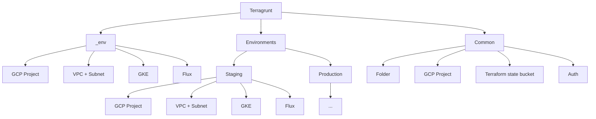
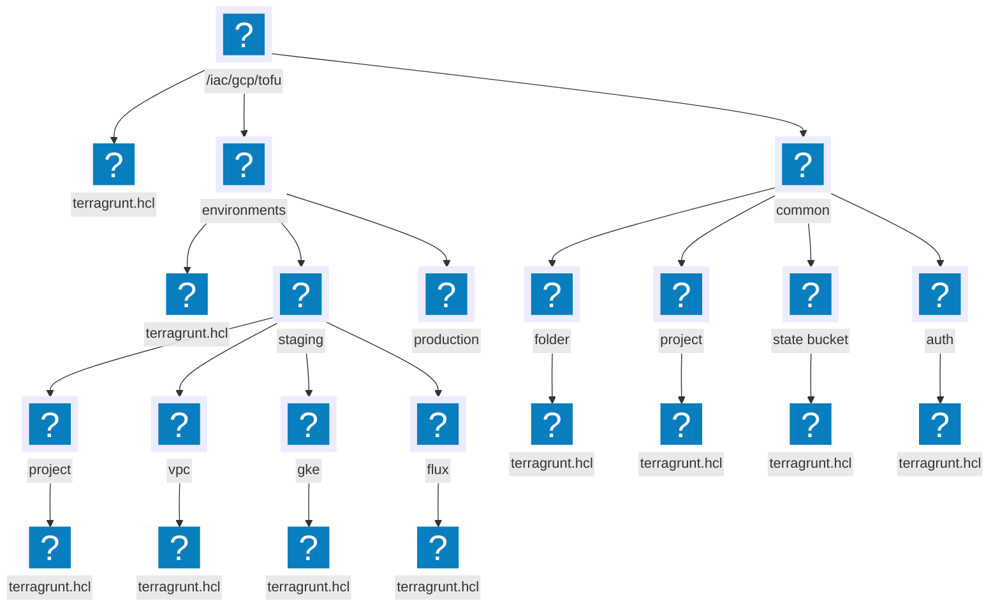

The previous lesson was an intro to our infrastructure as code project, where we created a GCP Project, VPC, GKE, and bootstraped our FluxCD into the cluster using OpenTofu.  
During this course we focus on best practices, this is why our cloud resources has to be created using IAC, we have to get used to using IAC to create our cloud resources, and the course repository is aiming not only to be the source code of our lessons but also a starter kit you can base your real projects on.  
When working on real projects we often have multiple environments, and multiple clusters, and we need to manage them in a way that is easy to maintain and scale.  
Those environments will vary in the resources they have, and the configuration they use, and we need to address those differences in this course.

That is why we will dedicate another lesson in IAC where we will learn how to create those multiple environments, while focusing on best practices, and avoid those DRY violations as much as possible.

## Lesson Plan

In this lesson we will learn how to create those multiple environments while avoiding DRY violations, focusing on best practices, and installing FluxCD into those environments.  
We will further discuss about the following topics:
- Breaking monolith infrastructure project to small projects
- About Terragrunt
- Storing our tofu/terraform state in a bucket
- Configuring Google Provider and authenticating using impersonation
- Creating modules
- Modules dependencies
- Creating multiple environments

## Bad Practice Monolith IAC Project

Creating an infrastructure gigantic super module is a really bad idea and should be avoided at all costs.  
this point is explained even better in [The following lecutre](https://blog.gruntwork.io/5-lessons-learned-from-writing-over-300-000-lines-of-infrastructure-code-36ba7fadeac1) but let me summarize the main points:
- very slow - as the infrastructure grows, a simple `terragrunt plan` might take forever to be calculated
- plan output impossible to understand - you get a gigantic plan which is hard to understand, follow, and it's really easy to miss important stuff in the plan like important stuff that are going to be deleted (if you have hundreds of changes it will be easy to miss)
- hard to test
- hard to reuse the code
- security - you will need to supply god permissions to whomever is running that code
- cuncurrency is limited to one developer
- a single small mistake can break everything

Large modules in infrastructure code are harmful.

In our case from the previous lesson we had one terraform state that was generated from one big `main.tf` file.
We need to strive to split our project to small modules with as much isolation as possible, isolation  based on environments and isolation based on the different types of infrastructures that needs to be created.

We need to define our big module to tiny modules, isolated as possible, logically seperated, and manage the dependencies for those modules.

## Bad practice: manage small isolated iac modules with Terraform/OpenTofu

Instead of 1 big IAC project i will now have many of them, using OpenTofu or Terraform to manage all of those projects will have it's difficulties:
- Repeating Providers configuration
- Repeating State storage configuration
- Repeating variables
- Unmanaged dependencies between modules
- Harder to `apply` changes on multiple modules
- Harder to reuse code

To help you manage those small modules it's recommended to use Terragrunt.

## Terragrunt

Terragrunt is a thin wrapper for Terraform/OpenTofu that provides extra tools for working with multiple Terraform/OpenTofu modules.  
Every module will have a `terragrunt.hcl` file which can include common providers, include reusable code, load repeating variables, and basically focus on the actual thing that the module is doing istead of all those DRY violation tedious things that you need to do every time you start a new terraform module.

Using it we will manage to create multiple environments that are consisting of small modules, with high reusable code between those environments.

## What we are going to create

Here is a diagram of what we are going to create in this lesson:

<div class="not-content">

</div>

:::note
prod structure is not specified for brevity, the structure is similar to staging
:::

We are going to create the following using Terragrunt:
- Common resources: Folder for all the resources, GCP Project, and a Terraform state bucket
- 2 environments: Production and Staging
- Each of those environments will have the following modules: GCP Project, VPC + Subnet, GKE, and FluxCD installed
- We will avoid duplication by creating `_env` with the repeating modules and include it in the environments

## Folder structure

We will place our code inside `iac/gcp/tofu` and we will have the following structure:

<div class="not-content">

</div>

:::note
prod structure is not specified for brevity, the structure is similar to staging
:::

## terragrunt.hcl

Terragrunt helps us run terraform.
In fact, if we are using terragrunt, every command that we issued before to terraform/tofu should now be issued to terragrunt (terragrunt will pass it along).
Terragrunt is a wrapper around terraform and those `terragrunt.hcl` files are configuration files used by terragrunt that will tell terragrunt how to do it's job.

Few things to learn from the previous diagram:
- Every module will be saved in a separate terraform state
- Every module will have a `terragrunt.hcl` file that will configure to run terraform code
- Usually the folder hierarchy defines a composition patterns where an inner folder `terragrunt.hcl` file can include a parent folder `terragrunt.hcl` file.  
This means that usually the root `terragrunt.hcl` will include common providers, common variables, and common configurations that are shared between all the modules.

Let's create the folder structure and empty `terragrunt.hcl` files.

## authentication and impersonation

When we are using IAC we need to authenticate with our cloud to create resources.
In the previous lesson we used the `gcloud auth application-default login` command to authenticate with our cloud and use our gcp user to create the resouces.
While that might be an acceptable solution for a single developer, it's not a good solution for a team or an organization.
Let's try to figure a better approach to that problem, while managing to work properly with a team of developers, and giving them the right amount of freedom they need to create resources.
Our solution will be based on the following code:

```hcl
# this 
provider "google" {
  alias = "impersonation"
  scopes = [
    "https://www.googleapis.com/auth/cloud-platform",
    "https://www.googleapis.com/auth/userinfo.email",
  ]
}

#impersonate 
data "google_service_account_access_token" "sa_impersonate" {
  provider               = google.impersonation
  target_service_account = "<email of a service account>"
  scopes                 = ["cloud-platform", "userinfo-email"]
  lifetime               = "3600s"
}

provider "google" {  
  access_token    = data.google_service_account_access_token.sa_impersonate.access_token
  request_timeout = "60s"
}
```

The first `provider "google" {...}` block is using our gcp user to authenticate with the cloud.
Using our user it will use the following data block: `data "google_service_account_access_token" "sa_impersonate" {...}` to get a short lived `access_token` to impersonate our user to a certain service account.
It will then use that `access_token` to authenticate with the cloud using the `provider "google" {...}` block.
which mean every resource block that starts with `google_` will use the impersonated service account to create the resources (in aws it's a similar concept but it's called **assume role**).

The `target_service_account` is the email of the service account we want to impersonate, and it's not going to be a fixed value, in our simple example, we will have the following configurations:
- admin group
- devops group
- developers group

each user in our organization can be placed in one of these groups if we want that user to have permissions to create certain cloud resources.
The **developers** group has the least permissions, the **devops** group has all the **developers** permissions and more, and the **admin** group has all the **devops** permissions and more.
We will give the **developers** group `owner` permission on the **staging** project, the **devops** group `owner` permission on the **production** and **common** project (and all **developers** permissions), and the **admin** group `owner` permission on the groups and service accounts.

Which service account to impersonate will be specified in a file called `auth.hcl` where in each level we can create that file to specify which service account is impersonated.
For example in the `staging` folder we will place an `auth.hcl` file with the following content:

```hcl
locals {
  service_account = "developers@..."
}
```

Which means that the impersonation here will be to the service account that is associated with the developers group.

This way we can control in each level what is the minimum group that is allowed to access that level.
This kind of authentication opens the group to a multi-tenant IAC project, where instead of being the cinderella of the cloud resources, where every developer will ask me to create cloud resources for him ("Do this cinderella, do that cinderella"), instead I'm placint the developer in the right group and tell him to create his own resources, freeing me to do more important stuff.


## Root terragrunt.hcl

A terragrunt project has a `terragrunt.hcl` folder hierarchy that defines a composition pattern.
The `terragrunt.hcl` at the root of the project contain terragrunt configurations that are shared between all the modules.
We will place logic there to load all common variables, define the google provider configurations, and define the state storage configurations (once our state bucket is created).

For now let's configure the google provider and authenticate using impersonation.


## common

The common folder contains cloud resources that are shared between all the environments.
For now those resources contain a folder which will group all the resources we create, a common project, and a bucket to store the terraform state.
IAC projects have a dependency graph so there are certain things that are at the bottom of the graph that other resources depend on, and those resources are usually created first.
Since every resource we create will be placed in our **Folder** we will create that first.

For now we will store

## terraform state stored in a bucket

We highly recommend not storing your terraform state locally, and instead store it in a remote secure location.
This will allow you to work on the infrastructure with multiple developers, and also allow you to have a backup of your state in case of a disaster.
We have multiple modules and each one will have to store their state at a separate location in a bucket we are going to create.
Usually that means that each one of those modules will have to define a `backend.tf` file with those different state configurations repeating in each module.
Since we have the composition pattern of terragrunt and every file can include configurations defined in the parent, we can define those state configurations in one place and share them in all our modules.
We can do that in the parent `terragrunt.hcl` file.

What we will define is storing all the states in the same bucket and using the module path as a different prefix for each state.
This will guarantee that each state is stored in a different location in the bucket.

To do that we will use terragrunt `remote_state` block.
The `remote_state` will help us store the state in a remote bucket, we will also use a terragrunt function `path_relative_to_include` to get the path of the module relative to the root of the project.
The combination of the two will give us a backend configuration to store in a bucket with a different prefix for each module.

Inside the file `iac/gcp/tofu/terragrunt.hcl` we will define the following:

```hcl

```