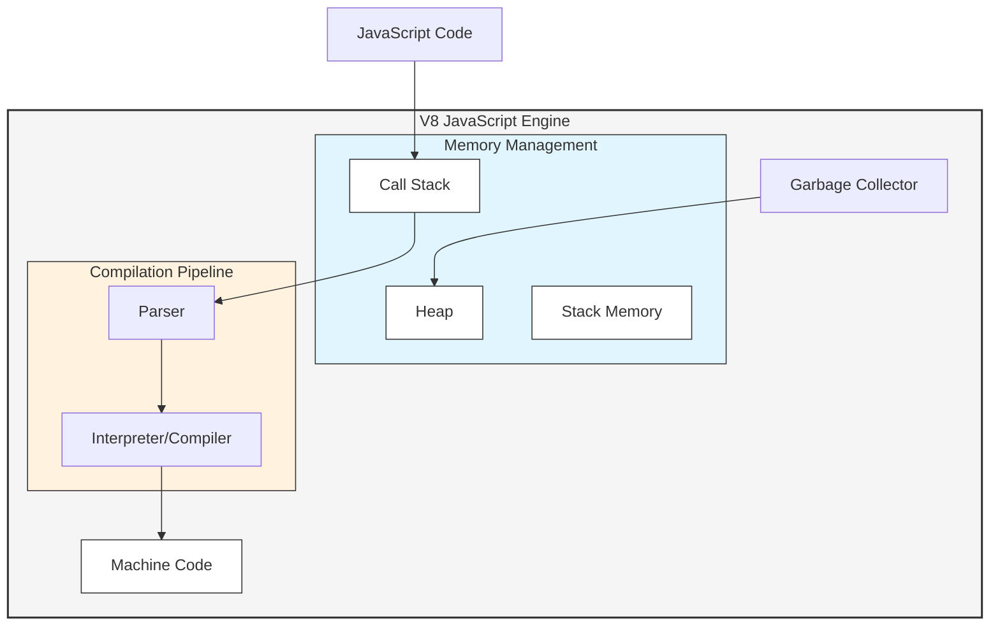

Unfortunately, I get to interview a lot of Node.JS developers, not a task I enjoy doing, but it's part of my job.  
One of the things that I noticed that the best developers also possess a good understanding of the underlying technology they are using, and not just problem solving, stackoverflow copy-pasting developers.
A developers with good understanding of the theory, internals, architecture, and design of Node.JS will probably be a good Node.JS developer, and these are the developers I'm looking for.
So when I interview a lot of my questions are not coding exercise, or api, or god forbid riddles (why do interviewers ask riddles in an interview is something I will never understand), but in depth questions about the theory behind the technology they are using.

One of the questions I always ask a Node.JS developer is: **"Is Node.JS single-threaded?"**.  
TLDR; the answer is **NO**.

90% of the developers I asked this question got it wrong.
Among the popular wrong answers are:
- Yes, Node.JS is single-threaded.
- No, there are api's like: [Cluster](https://nodejs.org/docs/latest/api/cluster.html) or [Worker Threads](https://nodejs.org/docs/latest/api/worker_threads.html) that allow you to run multiple Node processes or multiple threads in Node.JS.  
While this answer is correct It's not exactly what I want to test here so I elaborate on the question: "In an hypothetical world where there are no api's like Cluster or Worker Threads, is Node.JS single-threaded?".  
The Cluster and worker threads api are not something a Node.JS developer uses on a daily basis, it is used for specific use cases, and not the usual everyday Node.JS development.
So when I ask if Node.JS is single-threaded, I'm asking about the everyday Node.JS development, not those special cases.
And when I explain the question again then the Developer will return to the original wrong answer: "In that case then yes, Node.JS is single-threaded if those api's are not used".

## But look Ma, JavaScript is single-threaded

When I type in google **"JavaScript"** and navigate to the [MDN](https://developer.mozilla.org/en-US/docs/Web/JavaScript) or [wikipedia page](https://en.wikipedia.org/wiki/JavaScript) (or any other respectable site) they will all say JavaScript is single-threaded.
For example MDN says:

> *JavaScript (JS) is a lightweight interpreted (or just-in-time compiled) programming language with first-class functions. While it is most well-known as the scripting language for Web pages, many non-browser environments also use it, such as Node.js, Apache CouchDB and Adobe Acrobat. JavaScript is a prototype-based, multi-paradigm, single-threaded, dynamic language, supporting object-oriented, imperative, and declarative (e.g. functional programming) styles.*

So isn't it proof that Node.JS is single-threaded?

NO!

While JavaScript is a programming language, Node.JS is a runtime environment for JavaScript, although they are related, they represent different things.

## JavaScript, and JavaScript Runtime

Let's distinguish between these 2 concepts:

### JavaScript

JavaScript is a programming language, it is single-threaded, it's popular implementation is the [V8 engine](https://v8.dev/), developed by Google, and used in Chrome and Node.JS.
There is also the [SpiderMonkey](https://spidermonkey.dev/) engine, developed by Mozilla, and used in Firefox.

So JavaScript is a programming language that is defined by [ECMAScript](https://ecma-international.org/publications-and-standards/standards/ecma-262/) and the V8 engine is an implementation of that language.

### V8

Node.JS is using a JavaScript engine which is the V8 engine, developed by Google.
Here are some of the things that are included in the V8 engine:
- Call stack - where the code is placed and executed in a stack way (LIFO).
- Heap - where the memory allocation of non-primitive types is done.
- Garbage collector - which cleans up the memory.
- Turning JavaScript code into machine code (Parser, Interperter, Compiler).

### JavaScript Runtime

A JavaScript runtime (like Node.JS) includes a JavaScript engine (like V8), and allows us to run JavaScript code.
Our browsers are also an example of a JavaScript runtime.
Here are some of the things that are included in a Node.JS runtime:
- Event queue - stores the incoming client requests
- Event loop - infinite loop that executes the requests in the event queue
- V8 engine - Executes the JavaScript code
- Thread pool - The event loop can delegate tasks to the thread pool, which is a pool of threads that can execute tasks in parallel.

The Event loop and V8 both run in the same thread (AKA the main thread), but the thread pool can run in parallel.
Node.JS is single-threaded in the sense that the Event loop and V8 run in the same thread, there is a single main thread that executes the JavaScript code.
The Event loop runs on the main thread and can handle some I/O operations in a non-blocking way, and delegate external tasks to the thread pool.

I like to look at Node.JS as automatic multi-threading, mostly I program in a single-threaded way, and Node.JS then takes care of the multi-threading for me.

## Summary

So to answer the question: "Is Node.JS single-threaded?".
The answer is **NO**.
Node.JS is single-threaded in the sense that the Event loop and V8 run in the same thread - which is called the main thread, but it is multi-threaded in the sense that it can delegate tasks to the thread pool, and delegate tasks to the kernel.
The event Non-Blocking nature of Node.JS allows us to utilize the main thread, thread pool, kernel, and other resources in an efficient way, and utilize the full parallel capabilities of the machine.

The way I look at it, I get automatic multi-threading without the need to manage threads most of the time (managing threads is extremely hard and error-prone), and I can focus on writing the actual application while knowing that Node.JS is taking care of the multi-threading for me.

Why am I asking this question in an interview? And why is it important to know this?  
The theory is actually connecting to the practical when it comes to main thread starvation, and how to handle it.
Knowing what the main thread is handling and what is delegated elsewhere can really help when your server is slow.
There are many times when knowing those facts helped me solve that problem, when no other developer could.
For example if your server is slow you can profile the main thread to understand what tasks are blocking the main thread, you can examine memory leaks (cause the main thread is also running the garbage collector), and in some cases, yes you will have to use the Cluster or Worker Threads api to run multiple Node processes or multiple threads in Node.JS.

