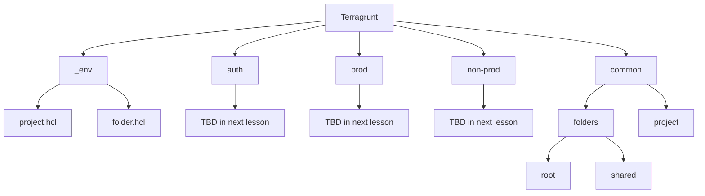

import { Tabs, TabItem } from '@astrojs/starlight/components';

<div class="not-content flex">
  <iframe
    class="mx-auto"
    width="560"
    height="315"
    src="https://www.youtube.com/embed/CBgJ5iTXLFY?si=5616DzHU9n45AWf8"
    title="Introduction to Terragrunt - video"
    allow="accelerometer; clipboard-write; encrypted-media; gyroscope; picture-in-picture; web-share"
    allowFullScreen
    loading="lazy"
    referrerPolicy="strict-origin-when-cross-origin"
    aria-label="Introduction to Terragrunt - video"
    aria-describedby="iframe-video-description"
  />
</div>
<span id="iframe-video-description" class="sr-only">
This video provides an introduction to Terragrunt, explaining its purpose and how it can be used to manage infrastructure as code projects with multiple small modules, while avoiding repetition and managing dependencies effectively.
</span>

The previous lesson was an intro to our infrastructure as code project, where we created a GCP Project, VPC, GKE, and bootstraped our FluxCD into the cluster using OpenTofu.  
During this course we focus on best practices, this is why our cloud resources has to be created using IAC (in our case Terraform/OpenTofu), we have to get used to using IAC to create our cloud resources, and the course repository is aiming not only to be the source code of our lessons but also a starter kit you can base your real projects on.  
When working on real projects we often have multiple environments, and multiple clusters, and we need to manage them in a way that is easy to maintain and scale.  
Those environments will vary in the resources they have, and the configuration they use, and we need to address those differences in this course.  
Moreover we might have different teams, projects, devops, and developers, all of them will have certain permission creating infrastructure based on the minimum permissions they require.

When creating infrastructure it's important to create small modules and reuse those modules as much as possible. 
For example since a lot of the environments will create a K8S managed cluster (using GKE) we can create a module for that and use that module in every environment that has a k8s cluster.
When using that module in an environment, a terraform state will be created for that module. We will want to store this state properly in a bucket.
Does this mean we will have to reconfigure backend for every reuse of that module, and reconfigure repeating providers?
NO! we will learn how to use terragrunt to manage those repeating configurations and avoid DRY violations.

This lesson will be an introduction to [Terragrunt](https://terragrunt.gruntwork.io/) where we will learn how to arrange our IAC project using Terragrunt, using terragrunt to split our project to small modules, using terragrunt to avoid DRY violation, and use terragrunt to manage the dependencies we have.


## Lesson Plan

In this lesson we will have an introduction to Terragrunt, and using terragrunt we will start arranging our IAC project.
We will cover the following topics:
- Introduction to Terragrunt
- Folder structure of IAC project
- Creating root `terragrunt.hcl`
- Creating shared terragrunt configurations
- Creating common project and folders
- Storing the state in a bucket

## Bad Practice Monolith IAC Project

Creating an infrastructure gigantic super module is a really bad idea and should be avoided at all costs.  
this point is explained even better in [The following lecutre](https://blog.gruntwork.io/5-lessons-learned-from-writing-over-300-000-lines-of-infrastructure-code-36ba7fadeac1) but let me summarize the main points:
- very slow - as the infrastructure grows, a simple `terragrunt plan` might take forever to be calculated
- `plan/output` impossible to understand - you get a gigantic plan which is hard to understand, follow, and it's really easy to miss important stuff in the plan like important stuff that are going to be deleted (if you have hundreds of changes it will be easy to miss)
- hard to test
- hard to reuse the code
- security - you will need to supply god permissions to whomever is running that code
- cuncurrency is limited to one developer
- a single small mistake can break everything

Large modules in infrastructure code are harmful.

In our case from the previous lesson we had one terraform state that was generated from one big `main.tf` file.
We need to strive to split our project to small modules with as much isolation as possible, isolation  based on environments and isolation based on the different types of infrastructures that needs to be created.

We need to define our big module to tiny modules, isolated as possible, logically seperated, and manage the dependencies for those modules.

## Bad practice: manage small isolated iac modules with Terraform/OpenTofu

Instead of 1 big IAC project i will now have many of them, using OpenTofu or Terraform to manage all of those projects will have it's difficulties:
- Repeating Providers configuration
- Repeating State storage configuration
- Repeating variables
- Unmanaged dependencies between modules
- Harder to `apply` changes on multiple modules
- Harder to reuse code

To help you manage those small modules it's recommended to use Terragrunt.

## Introduction to Terragrunt

Terragrunt is a thin wrapper for Terraform/OpenTofu that provides extra tools for working with multiple Terraform/OpenTofu modules.  
Every module will have a `terragrunt.hcl` file which can include common providers, include reusable code, load repeating variables, and basically focus on the actual thing that the module is doing istead of all those DRY violation tedious things that you need to do every time you start a new terraform module.
Every module we create will be stored in a separate terraform state, and we will use terragrunt to store that state in a gcp bucket.
Using terragrunt will manage to create multiple environments that are consisting of small modules, with high reusable code between those environments.

### Terragrunt cli

We can install terragrunt using 

```bash
> brew install terragrunt
```

As mentioned terragrunt is a wrapper around terraform, so every command that we issued before to terraform/tofu should now be issued to terragrunt (terragrunt will pass it along).
In addition terragrunt will add some extra commands that are useful for managing multiple modules.
For example we can run `terragrunt run-all apply` to apply changes on all the modules in the project.

### Terragrunt helps with small modules project

With terragrunt it will be easy to manage a IAC project that is built using small modules.
Terragrunt will help us manage the dependencies between those modules, and run things in the proper order while taking those dependencies into consideration.
Using terragrunt we can avoid DRY violations, and manage the repeating configurations in a single place. We will see example of that during this lesson.

## Folder structure

The folder structure plays an important role in the terragrunt project.
We use a lot of composition (we will refer to it here as inheritance although it's more like composition) in terragrunt, and that inheritance is based on the folder structure.
We usually place shared logic in the parent folder and it can be used in the children folders.
Let's go over the folder structure of our IAC project:

<div class="not-content">

</div>

Let's go over the planned architecture:
- `_env` contains reusable terragrunt configurations
- `common` - common resource shared between all the environments
- `prod/non-prod` - those are the environments we will create (we will create this in future lesson)
- `auth` - represents the groups, users, service accounts, and permissions we will use to authenticate with the cloud

## Terragrunt functions, blocks, attributes

Here are a few terragrunt functions, blocks, and attributes that we will use in this lesson.

### blocks

To configure terragrunt we will use the following blocks:

- `locals` - define local variables that can be used in the terragrunt configuration
- `generate` - generate a file with the content specified in the `contents` attribute
- `include` - include a terragrunt configuration file
- `dependency` - define a dependency between terragrunt modules
- `terraform` - define a terraform block that will be included in the generated terraform code
- `remote_state` - define a remote state configuration

### attributes and functions

To configure terragrunt we will use the following attributes and functions:

- `inputs` - define inputs to the terragrunt code we are using, similar to `variables` in terraform and their values.
- `find_in_parent_folders()` - find a file in the parent folders of the current terragrunt configuration file
- `path_relative_to_include()` - get the path of the module relative to the root of the project

### Terraform/OpenTofu functions

You can still use Terraform/OpenTofu functions in terragrunt configurations, here are some functions we will use:
- `dirname()` - get the directory name of a file
- `file()` - read the content of a file
- `yamldecode()` - decode a yaml file.

## Root terragrunt.hcl - simple configuration

The root `terragrunt.hcl` is located at the root of the project at the path: `/iac/gcp/tofu/terragrunt.hcl`.
There is a composition pattern that match the folder hyerarchy, so the root `terragrunt.hcl` will contain configurations that are shared between all the modules.
Create the root `terragrunt.hcl` file with the following content:

```hcl
/**
 * The root terragrunt will contain:
 *    - common provider configurations
 *    - remote state configuration
 *    - impersonation logic
 *
 */
 
locals {
  region_vars = yamldecode(file(find_in_parent_folders("region_vars.yaml")))
  billing_vars = yamldecode(file(find_in_parent_folders("billing_vars.yaml")))
  common_vars = yamldecode(file(find_in_parent_folders("common_vars.yaml")))
  region = local.region_vars.region
  billing_project = local.billing_vars.billing_project
}

# configure common providers
generate "provider" {
	path = "provider.tf"
	if_exists = "overwrite"
	contents = <<EOF
provider "google" {	
	region  = "${local.region}"
	billing_project = "${local.billing_project}"
	user_project_override = true
}
EOF
}
``` 

Few things to note in this simple configuration:
- There are certain variables that will repeat in many modules, we are placing those variables in a files that end with `_vars.yaml` and we are loading those variables using the `locals` block.
some of those file are ignored and examples of them you can find with `.example` suffix.
You can always override if you place a file with the same name in a inner module
- We are generating a provider configuration that will authenticate to the GCP cloud using the user's credentials, this means we can define this `provider` info only once and other modules will reuse this logic.

This simple configuration will help us start creating some basic resources that we need before we begin.
You need to make sure to login to GCP by running:

```bash
> gcloud auth application-default login
```

## _env - Folder, Project

The `_env` folder contains reusable modules that are shared between the different environments and sections of our IAC Project, think of it like configuration functions that can be called repeatedly in Terragrunt configurations.
The `_env` will usse as much as possible modules from the project: [terraform-google-modules](https://registry.terraform.io/namespaces/terraform-google-modules).
This is also a place where we can give repeating values for the `terraform-google-modules` to save us the hassle of repeating those values in every module.
Inside the `/iac/gcp/tofu/_env` we will create the files: `folder.hcl`, `project.hcl`.

<Tabs>
  <TabItem value="folder.hcl" label="folder.hcl">
```hcl
/**
 * terragrunt function to create a folder
 */
 
locals {
	org_id = yamldecode(file(find_in_parent_folders("common_vars.yaml"))).org_id
}

terraform {
	source = "tfr:///terraform-google-modules/folders/google?version=5.0.0"
}

inputs = {
	parent = "organizations/${local.org_id}"
}
```
  </TabItem>
  <TabItem value="project.hcl" label="project.hcl">
```hcl
/**
 * terragrunt function to create a project
 */
 
locals {
	org_id = yamldecode(file(find_in_parent_folders("common_vars.yaml"))).org_id
	billing_account = yamldecode(file(find_in_parent_folders("billing_vars.yaml"))).billing_account
}

terraform {
	source = "tfr:///terraform-google-modules/project-factory/google?version=17.1.0"
}

inputs = {
	random_project_id    = true
	org_id = local.org_id
	billing_account = local.billing_account
	budget_amount = 20
}
```
  </TabItem>  
</Tabs>

After we created those simple reusable terraform configurations, based on `terraform-google-modules`, we can now use those configurations to create some resources we will need for terraform to store the state in the bucket.

## Common - Folder, Project

We will use the `_env` modules we just created to create the `common` folder with module for the folder, and project.
We will create a few files:
- `common/folders/root/terragrunt.hcl` - this will create the root folder `academeez-k8s-flux`
- `common/folders/shared/terragrunt.hcl` - under the root folder we will create a folder called `shared` for the shared resources
- `common/project/terragrunt.hcl` - this will create the project `academeez-k8s-flux-common`

<Tabs>
  <TabItem value="common/folder/terragrunt.hcl" label="common/folder/root/terragrunt.hcl">
```hcl
/**
 * Create the root folder, all the resources will be created under this folder
 */

include "root" {
  path   = find_in_parent_folders()
}

include "folder" {
	path = "${dirname(find_in_parent_folders())}/_env/folder.hcl"
}

inputs = {
	names = [ "academeez-k8s-flux" ]
}
```
  </TabItem>
  <TabItem value="common/folder/shared/terragrunt.hcl" label="common/folder/shared/terragrunt.hcl">
```hcl
/**
 * The shared folder will contain all the shared resources between environments
 */

include "root" {
	path   = find_in_parent_folders()
}

include "folder" {
	path = "${dirname(find_in_parent_folders())}/_env/folder.hcl"
}

# since this folder is under the root folder we will use dependency to get the parent folder
dependency "root_folder" {
	config_path = "../root"
}

inputs = {
	parent = dependency.root_folder.outputs.id
	names = [ "shared" ]
}
```
  </TabItem>
  <TabItem value="common/project/terragrunt.hcl" label="common/project/terragrunt.hcl">
```hcl
/**
 * The common resources that are shared between the environments will be under the common project
 */

include "root" {
	path   = find_in_parent_folders()
}

include "project" {
	path = "${dirname(find_in_parent_folders())}/_env/project.hcl"
}

# since the project will be under the shared folder we will grab it using the dependency block
dependency "shared_folder" {
	config_path = "../folders/shared"
}

inputs = {
	folder_id = dependency.shared_folder.outputs.id
	name = "academeez-k8s-flux-common"
}
```
  </TabItem>  
</Tabs>

We are simply using the `_env` modules we created to create a root folder, a shared folder under the root folder, a project to hold the common resources.
Few things to note:
- When we want to create cloud resources we will usually inherit the root configuration defined in the root `terragrunt.hcl` file.
We do that in the first include using the `find_in_parent_folders()` function which will point to the nearest parent `terragrunt.hcl` file.
And if we want the root directory we can use the `dirname(find_in_parent_folders())` function.
- We use the `dependency` block to grab information from other modules, for example the project we are creating will need the folder id.
This creates a dependency between the project and the shared folder, and the project will wait for the folder to be created before it will be created.
Terragrunt will help us manage those dependencies and create the resources in the right order.
- Notice that we are storing in the `common_vars.yaml` file the `common_project` variable, this is the if of the project we just created.

After all this code is written we can run apply on the `common` project and create all those resources using one command:

```bash
terragrunt run-all apply -input=true
```

## Store the state in a bucket

By default terragrunt will place the terraform state locally on disk under the `.terragrunt-cache` folder.
We need to configure things to be more secure, state to be shared between developers, and to have a backup of the state in case of a disaster, also versioning of the states will be useful as well in cases we need to roll back a certain change.
It's recommended to store the state in a remote location, we will store the state in a GCP bucket.
Instead of repeating the configuration to store the state in the bucket, we will configure it in the root `terragrunt.hcl` file.
This way that configuration will be shared between all the modules.
Modify the root `terragrunt.hcl` file to include the following:

```hcl title="iac/gcp/tofu/terragrunt.hcl"
locals {
	region_vars = yamldecode(file(find_in_parent_folders("region_vars.yaml")))
	billing_vars = yamldecode(file(find_in_parent_folders("billing_vars.yaml")))
	common_vars = yamldecode(file(find_in_parent_folders("common_vars.yaml")))
	region = local.region_vars.region
	billing_project = local.billing_vars.billing_project
	common_project = local.common_vars.common_project
}
 
# configure remote state in bucket
remote_state {
  backend = "gcs"
	generate = {
		path = "backend.tf"
		if_exists = "overwrite"		
	}
  config = {
    project  = local.common_project
    location = "eu"
    bucket   = "academeez-k8s-flux-terragrunt-state"
    prefix   = "${path_relative_to_include()}/tofu.tfstate"
  }
}

// ...
```

We are using `terragrunt` [`remote_state`](https://terragrunt.gruntwork.io/docs/reference/config-blocks-and-attributes/#remote_state) block to store the state in a remote bucket.
This configuration will be shared in all the modules and using the `path_relative_to_include()` function we will store the state in a different location in the bucket for each module according to their path location.
The `remote_state` block will also create the bucket the first time.

After this code is added we can transfer all the state to the bucket using the following command:

```bash
terragrunt run-all init -reconfigure -input=true
```
## Summary

In this lesson we learned about a tool we will be using in our IAC project called Terragrunt.
Using Terragrunt we will split our IAC project to small modules, manage the dependencies between those modules, and avoid DRY violations.
We instruct Terragrunt how to work by creating configurations files called `terragrunt.hcl`, we often use inheritance to avoid those repeating logic like storing the state in s3, or configuring providers.
We also managed to avoid those repeating variables that we always had to define when working with terraform modules.

We will continue working with terragrunt on the next lesson when we will configure authentication and impersonations, and learn how to do it properly.
