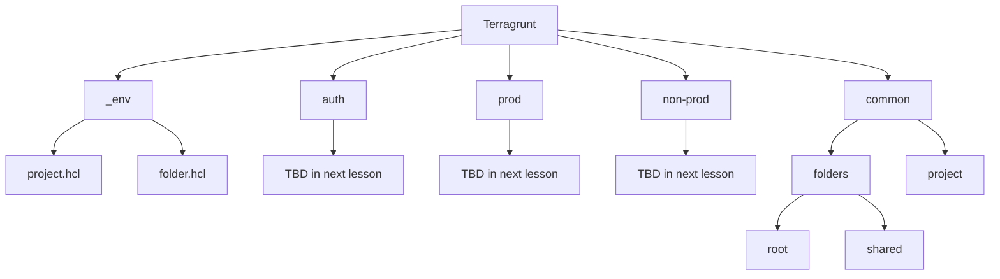

import { Tabs, TabItem } from '@astrojs/starlight/components';

<div class="not-content flex">
  <iframe
    class="mx-auto"
    width="560"
    height="315"
    src="https://www.youtube.com/embed/CBgJ5iTXLFY?si=5616DzHU9n45AWf8"
    title="Introduction to Terragrunt - video"
    allow="accelerometer; clipboard-write; encrypted-media; gyroscope; picture-in-picture; web-share"
    allowFullScreen
    loading="lazy"
    referrerPolicy="strict-origin-when-cross-origin"
    aria-label="Introduction to Terragrunt - video"
    aria-describedby="iframe-video-description"
  />
</div>
<span id="iframe-video-description" class="sr-only">
This video provides a comprehensive introduction to Terragrunt, explaining its purpose, how to use it for managing infrastructure as code with Terraform/OpenTofu, and best practices for organizing and maintaining infrastructure projects with practical examples.
</span>

בשיעור קודם קיבלנו היכרות עם פרוייקט ה - infrastructure as code שלנו, יצרנו פרוייקט GCP, VPC, GKE, והפעלנו את FluxCD בקלאסטר שלנו באמצעות OpenTofu.  
במהלך קורס זה אנחנו מתמקדים על best practices, זהו למה כל המשאבים בענן שלנו צריכים להיות נוצרים באמצעות IAC (במקרה שלנו Terraform/OpenTofu), עלינו להתרגל להשתמש ב IAC ליצירת המשאבים בענן שלנו, ותיקיית הקורס מתמקדת לא רק להיות קוד המקור של השיעורים שלנו אלא גם ערכת הכלים שאתה יכול לבסס עליה את הפרוייקטים האמיתיים שלך.  
כאשר עובדים על פרוייקטים אמיתיים יש לנו לעיתים קרובות יותר מסביבות אחת, ויותר מקלסטר אחד, ואנחנו צריכים לנהל אותם בדרך שתהיה קלה לתחזוקה ולהתרחבות.  
אותן הסביבות ישתנו במשאבים שיש להם, בהגדרות שהם משתמשים בהם, ואנחנו צריכים להתמודד עם ההבדלים האלה בקורס זה.  
יתרה מכך יש לנו צורך לנהל את ההרשאות של הפרוייקטים שלנו, ולהפריד את ההרשאות של הפרוייקטים השונים, הצוותים, הפרוייקטים, ה devops, והמפתחים, כל אחד מהם יצטרך הרשאות מינימליות ליצירת התשתיות שהם צריכים.

כאשר יוצרים תשתיות חשוב ליצור מודולים קטנים ולהשתמש בהם כמה שיותר.
לדוגמא מאחר והרבה מהסביבות יצרו קלאסטר K8S מנוהל (באמצעות GKE) אנחנו יכולים ליצור מודול לכך ולהשתמש בו בכל סביבה שיש לה קלאסטר K8S.
כאשר משתמשים במודול כזה בסביבה, ייווצר עבורו state של terraform, ואנחנו רוצים לשמור את ה state בצורה מאובטחת בתוך bucket.
האם זה אומר שנצטרך להגדיר מחדש את ה backend של כל מודול שנשתמש בו? ואם כן, האם זה אומר שנצטרך להגדיר מחדש את ה backend של כל מודול שנשתמש בו, ולהגדיר מחדש את הספקים של כל מודול שנשתמש בו?
התשובה היא לא, ובשיעור זה נלמד איך להשתמש ב - Terragrunt כדי לנהל את ההתקנות שלנו בצורה נכונה ומאורגנת תוך כדי מניעת DRY violations.

שיעור זה יהווה היכרות ראשונית עם [Terragrunt](https://terragrunt.gruntwork.io/) ונלמד כיצד לארגן את הפרוייקט IAC שלנו באמצעות Terragrunt, נלמד כיצד לפצל את הפרוייקט שלנו למודולים קטנים, נלמד כיצד למנוע DRY violations באמצעות Terragrunt, ונלמד כיצד לנהל את התלותים שלנו באמצעות Terragrunt.

## תוכנית השיעור

זהו שיעור היכרות עם שבו נתחיל לנהל את פרוייקט ה IAC שלנו באמצעות Terragrunt.
נלמד את הנושאים הבאים:
- היכרות עם Terragrunt
- מבנה התיקיות
- יצירת ה - `terragrunt.hcl` בשורש הפרוייקט
- יצירת קונפיגורציות שחוזרות על עצמן
- יצירת common שיכיל תיקיות ופרוייקט
- איחסון ה state ב bucket

## הרגל רע: פרוייקט IAC מונוליטי

יצירת פרוייקט infastructure שמורכב מיחידת state אחת עצומה בגודלה הוא רעיון רע שמומלץ בחום להימנע ממנו.
הנקודה מוסברת בצורה ברורה בהרצאה הבאה: [The following lecutre](https://blog.gruntwork.io/5-lessons-learned-from-writing-over-300-000-lines-of-infrastructure-code-36ba7fadeac1) אבל אני אסכם את הנקודות העיקריות:
- איטיות - ככל שהתשתיות גדלה, פעולות פשוטות כמו `terragrunt plan` יקחו זמן רב
- `plan/output` בלתי אפשרי להבנה - מתקבל תוצאת plan עצומה שקשה להבין, לעקוב אחריה, וקל לפספס דברים חשובים בתוך התוכנית כמו דברים חשובים שימחקו (אם יש לכם מאות שינויים זה יהיה קל לפספס)
- קשה לכתוב טסטים
- קושי בשימוש חוזר בחלקי קוד
- אבטחה - תצטרכו לספק הרשאות כל-יכול למי שמריץ את הקוד
- מקביליות של הרצה של מספר מפתחים היא יותר קשה
- קל לטעות והנזק יהיה יותר משמעותי

מודולים גדולים בקוד התשתיות עושים נזק וקשים לתחזוקה.

במקרה שלנו מהשיעור הקודם יש לנו פרוייקט מונוליטי עם state אחד שנוצר מקובץ `main.tf` אחד.
צריך לשאוף לפצל את הפרוייקט למודולים קטנים עם כמה שיותר בידוד, בידוד על פי סביבות ובידוד על פי סוגי התשתיות שצריך ליצור.

צריך לפצל את המודול הגדול למודולים קטנים, מבודדים ככל האפשר, מחולקים לפי סוגי התשתיות שהם יוצרים, ולנהל את התלותים ביניהם.

## הרגל רע: ניהול מודולים קטנים מבודדים באמצעות Terraform/OpenTofu

במקום פרוייקט IAC אחד גדול עם state אחד, נחלק אותו למודולים קטנים עם state משלהם, אם ננסה לנהל את זה באמצעות Terraform/OpenTofu נתקל בקשיים:
- חזרה על הקונפיגורציות של ה - Providers
- חזרה על הקונפיגורציות של אחסון ה - state בתוך bucket
- משתנים שחוזרים על עצמם
- קושי בניהול התלות בין המודולים השונים
- קושי בהרצת `apply` על מספר מודולים ובסדר הנכון
- קושי בשימוש חוזר בקוד

מומלץ להשתמש ב - Terragrunt כדי לנהל את המודולים הקטנים בצורה נכונה ומאורגנת.

## היכרות עם Terragrunt

Terragrunt יעטוף לנו את ה - Terraform/OpenTofu ויספק לנו כלים נוספים לניהול מודולים רבים.  
כל מודול יכיל קובץ `terragrunt.hcl` שיכול לכלול הגדרות providers שחוזרים על עצמם, לכלול קוד שחוזר על עצמו, לטעון משתנים חוזרים, ובאופן כללי להתמקד בדברים החדשים שהמודול עושה תוך כדי מינימום חזרה על קוד קיי והגדרות שחוזרות שהיינו צריכים לכלול אם היינו עובדים עם Terraform/OpenTofu בלבד.
כל מודול שניצור יכיל state נפרד שיאוחסן ב bucket.
באמצעות Terragrunt נוכל ליצור סביבת פרודקשיין וסביבת נון פרודקשיין, שמורכבים ממודולים שחוזרים על עצמם, עם שימוש ללא שכפול קוד במודולים שחוזרים על עצמם.

### Terragrunt cli

ניתן להתקין את Terragrunt באמצעות הפקודה:

```bash
> brew install terragrunt
```

כפי שהזכרנו Terragrunt הוא מעטפת זעירה סביב terraform, אז כל פקודה שהיינו מריצים באמצעות הפקודה terraform/tofu עכשיו הופכת להיות terragrunt (terragrunt תעביר את הפקודה ל terraform/tofu).
בנוסף terragrunt יוסיף פקודות נוספות שיעזרו לנו בניהול מודולים רבים.
לדוגמא נוכל להריץ `terragrunt run-all apply` כדי להפעיל שינויים בכל המודולים תחת התיקייה שאנחנו נמצאים בה.

### Terragrunt יעזור לנו בניהול פרוייקט שמורכב ממודולים קטנים

באמצעות Terragrunt יהיה קל לנו לנהל פרוייקט IAC שנבנה ממודולים קטנים.
Terragrunt יעזור לנו לנהל את התלותיות בין אותם המודולים, ויעוזר לנו להריץ את אותן המודולים בסדר הנכון תוך כדי התחשבות באותן התלותיות בין המודולים.
באמצעות Terragrunt ניתן להימנע מ - DRY violations, ולנהל את ההגדרות החוזרות במקום אחד. נראה דוגמא לכך במהלך השיעור.

## מבנה התיקיות

מבנה התיקיות משחק תפקיד חשוב בפרוייקט Terragrunt.
אנחנו משתמשים הרבה ב - composition (נקרא לזה כאן inheritance אף על פי שזה יותר דומה ל composition) ב Terragrunt, וההתייחסות להורשה היא על פי מבנה התיקיות.
בדרך כלל נשים את הלוגיקה המשותפת בתיקיית ההורה, והיא יכולה להיות נגישה לתיקיות הילד.
נעבור על מבנה התיקיות של הפרוייקט שלנו:

<div class="not-content">

</div>

נעבור על התוכנית:
- `_env` - תיקיית ה - `_env` מכילה פונקציות terragrunt ליצירת רכיב כךשהוא.
- `common` - תיקיית ה - `common` מכילה רכיבים שמשותפים לכל הסביבות.
- `prod/non-prod` - תיקיות ה - `prod` וה - `non-prod` מכילות את הסביבות שלנו (נציג את הסביבות בשיעורים הבאים).
- `auth` - תיקיית ה - `auth` מכילה groups, users, service accounts, והרשאות שנשתמש בהן לאימות עם הענן.

## פונקציות, בלוקים, ו - attributes של Terragrunt

אומרים ל Terragrunt איך לעבוד באמצעות קבצי קונפיגורציה שכתובים ב - HCL. לקבצי הקונפיגורציה ניתן להשתמש במספר דברים יחודיים ל - Terragrunt וגם בפונקציות של Terraform/OpenTofu.  
נעבור על מספר דברים ש Terragrunt הוסיף שניתן להשתמש בקבצי הקונפיגורציה, ונסביר על אותם האלמנטים שבהם נשתמש בשיעור זה.

### בלוקים

לקבצי הקונפיגורציה של terragrunt נשתמש בבלוקים הבאים:

- `locals {}` - מאפשר להגדיר משתנים מקומיים שניתן להשתמש בהם בקובץ הקונפיגורציה.
- `generate "someName" {}` - מאפשר ליצור קובץ חדש בזמן הריצה שיכיל קוד חדש. 
- `include "someName" {}` - מאפשר לכלול קובץ קונפיגורציה אחר בקובץ הקונפיגורציה.
- `dependency "someName" {}` - מאפשר להגדיר תלות בין מודולים.
- `terraform {}` - הרצת קוד terraform בקובץ הקונפיגורציה.
- `remote_state {}` - הגדרת אחסון ה state ב bucket.

### attributes ופונקציות

להגדרת terragrunt נשתמש בפונקציות וב attributes הבאים:

- `inputs = {}` - הגדרות variables ואתחולם שמועברים לקוד ה - terraform שמחובר.
- `find_in_parent_folders()` - מחפש קובץ בתיקיות ההורה.
- `path_relative_to_include()` - מחזיר את הנתיב של המודול שהריץ את הקוד יחסית לנתיב של הקובץ שהריץ את הפונקציה.

### פונקציות ב - Terraform/OpenTofu

בקבצי הקונפיגורציה של terragrunt ניתן עדיין להשתמש בפונקציות של terraform/OpenTofu, כאשר נשתמש בפונקציות של terraform/OpenTofu נשתמש בהן באופן רגיל כמו שהיינו עושים בקובץ הקונפיגורציה של terraform/OpenTofu. להלן רשימה של פונקציות שנשתמש בהן בשיעור זה:
- `dirname()` - מחזיר את שם התיקייה של הקובץ.
- `file()` - קורא את תוכן הקובץ.
- `yamldecode()` - ממיר קובץ yaml למשתנה.

## יצירת ה - `terragrunt.hcl` בשורש הפרוייקט

הפרוייקט IAC שלנו נמצא בתיקייה `/iac/gcp/tofu`, ובתיקייה זו ניצור את הקובץ `terragrunt.hcl` שיכיל את ההגדרות המשותפות לכל המודולים.
ניצור את הקובץ `terragrunt.hcl` בתיקיית הפרוייקט ונכניס אליו את ההגדרות הבאות:

```hcl
/**
 * The root terragrunt will contain:
 *    - common provider configurations
 *    - remote state configuration
 *    - impersonation logic
 *
 */
 
locals {
  region_vars = yamldecode(file(find_in_parent_folders("region_vars.yaml")))
  billing_vars = yamldecode(file(find_in_parent_folders("billing_vars.yaml")))
  common_vars = yamldecode(file(find_in_parent_folders("common_vars.yaml")))
  region = local.region_vars.region
  billing_project = local.billing_vars.billing_project
}

# configure common providers
generate "provider" {
	path = "provider.tf"
	if_exists = "overwrite"
	contents = <<EOF
provider "google" {	
	region  = "${local.region}"
	billing_project = "${local.billing_project}"
	user_project_override = true
}
EOF
}
``` 

נשים לב למספר נקודות:
- ישנם משתנים שהולכים לחזור על עצמם במודולים רבים, את אותם המשתנים מאגדים תחת לוגיקה והקשר מסויים, ושמים אותם בקבצים כמו: `common_vars.yaml`, `region_vars.yaml`, `billing_vars.yaml`. ניתן למצוא את חלק מהקבצים האלו, וחלק מוסתרים אז ניתן לראות את הקבצים עם סיומת של `example.yaml` בתיקיית הפרוייקט.
למרות שאותם משתנים מוגדרים בקבצים ניתן לעקוף אותם במידה ויוצרים קובץ עם שם דומה בתיקייה פנימית של המודול.
- אנחנו מגדירים את ה google provider ובנתיים לצורך האימות הוא ישתמש במשתנה שלנו ב gcp. לא צריך להגדיר את ה google provider במודולים הפנימיים שפשוט יכללו את ההגדרות ששמנו פה.

הגדרות הבסיסיות האלה בשורש הפרוייקט יאפשרו לנו להתחיל ליצור את המשאבים הדרושים.
יש לוודא שמתחברים ל gcp על ידי הרצת הפקודה:

```bash
> gcloud auth application-default login
```

## _env - Folder, Project

תיקיית ה - `_env` תכיל קונפיגורציות שחוזרות על עצמן, מאן פונקציות לשימוש חוזר בקוד.
ה - `_env` תשתמש במידה רבה במודולים של הפרוייקט: [terraform-google-modules](https://registry.terraform.io/namespaces/terraform-google-modules).
ניתן גם לקודד את ה input ים שחוזרים על עצמם באותם הקבצים זה יחסוך  את העבודה של להכניס אינפוטים שחוזרים על עצמם.
בתוך התיקייה `/iac/gcp/tofu/_env` ניצור את הקבצים: `folder.hcl`, `project.hcl`.

<Tabs>
  <TabItem value="folder.hcl" label="folder.hcl">
```hcl
/**
 * terragrunt function to create a folder
 */
 
locals {
	org_id = yamldecode(file(find_in_parent_folders("common_vars.yaml"))).org_id
}

terraform {
	source = "tfr:///terraform-google-modules/folders/google?version=5.0.0"
}

inputs = {
	parent = "organizations/${local.org_id}"
}
```
  </TabItem>
  <TabItem value="project.hcl" label="project.hcl">
```hcl
/**
 * terragrunt function to create a project
 */
 
locals {
	org_id = yamldecode(file(find_in_parent_folders("common_vars.yaml"))).org_id
	billing_account = yamldecode(file(find_in_parent_folders("billing_vars.yaml"))).billing_account
}

terraform {
	source = "tfr:///terraform-google-modules/project-factory/google?version=17.1.0"
}

inputs = {
	random_project_id    = true
	org_id = local.org_id
	billing_account = local.billing_account
	budget_amount = 20
}
```
  </TabItem>  
</Tabs>

אחרי שיצרנו את הפונקציות terragrunt שלנו המבוססות על `terraform-google-modules`, נוכל להשתמש בקונפיגורציות הפונקציות האלו כדי ליצור משאבים שנצטרך כדי ליצור את ה state ב bucket.

## Common - Folder, Project

נשתמש במודולים שיצרנו ב - `_env` כדי ליצור את ה - `common` שבו ניצור את ה folder, project.
ניצור מספר קבצים:
- `common/folders/root/terragrunt.hcl` - זה יצור את התיקייה הראשית `academeez-k8s-flux`
- `common/folders/shared/terragrunt.hcl` - תחת התיקייה הראשית ניצור תיקייה שנקראת `shared` למשאבים שמשותפים
- `common/project/terragrunt.hcl` - זה יצור את הפרוייקט `academeez-k8s-flux-common`

<Tabs>
  <TabItem value="common/folder/terragrunt.hcl" label="common/folder/root/terragrunt.hcl">
```hcl
/**
 * Create the root folder, all the resources will be created under this folder
 */

include "root" {
  path   = find_in_parent_folders()
}

include "folder" {
	path = "${dirname(find_in_parent_folders())}/_env/folder.hcl"
}

inputs = {
	names = [ "academeez-k8s-flux" ]
}
```
  </TabItem>
  <TabItem value="common/folder/shared/terragrunt.hcl" label="common/folder/shared/terragrunt.hcl">
```hcl
/**
 * The shared folder will contain all the shared resources between environments
 */

include "root" {
	path   = find_in_parent_folders()
}

include "folder" {
	path = "${dirname(find_in_parent_folders())}/_env/folder.hcl"
}

# since this folder is under the root folder we will use dependency to get the parent folder
dependency "root_folder" {
	config_path = "../root"
}

inputs = {
	parent = dependency.root_folder.outputs.id
	names = [ "shared" ]
}
```
  </TabItem>
  <TabItem value="common/project/terragrunt.hcl" label="common/project/terragrunt.hcl">
```hcl
/**
 * The common resources that are shared between the environments will be under the common project
 */

include "root" {
	path   = find_in_parent_folders()
}

include "project" {
	path = "${dirname(find_in_parent_folders())}/_env/project.hcl"
}

# since the project will be under the shared folder we will grab it using the dependency block
dependency "shared_folder" {
	config_path = "../folders/shared"
}

inputs = {
	folder_id = dependency.shared_folder.outputs.id
	name = "academeez-k8s-flux-common"
}
```
  </TabItem>  
</Tabs>

אנחנו משתמשים בקונפיגורציות שיצרנו בתיקיית `_env` כדי ליצור תיקיית root, shared, ופרוייקט שיכיל את המשאבים המשותפים.
כמה נקודות לשים לב:
- כאשר נרצה להגיד ל terragrunt ליצור משאבי ענן, בדרך כלל אנחנו נכלול את הקונפיגורציות שרשמנו ב terragrunt.hcl ששמנו בשורש של הפרוייקט.
את זה אנחנו עושים בבלוק ה include הראשון `include "root" {}` ואנחנו מגיעים לשורש הפרוייקט על ידי קריאה לפונקציה `find_in_parent_folders()` שיצביע לקובץ ה terragrunt.hcl שבשורש הפרוייקט.
וכדי לקבל רק את תיקיית השורש נעטוף את זה בפונקציה `dirname(find_in_parent_folders())`.
- אנחנו משתמשים ב `dependency` block כדי לקבל את התלות בין המודולים, לדוגמא במודול של הפרוייקט המשותף אנחנו משתמשים בתלות בין המודול של הפרוייקט לתיקיית ה shared.
זה יוצרת תלות בין המודולים והמודול יחכה ליצירת התיקייה ה shared לפני שהוא ייצור את הפרוייקט.
Terragrunt יסייע לנו לנהל את התלות בין המודולים ולהריץ אותם בסדר הנכון.
- שימו לב שאנחנו נאחסן את הפרוייקט שאנחנו יוצרים ב `common_vars.yaml` תחת המשתנה `common_project` ונשתמש בו במודולים הבאים. 

אחרי שכל הקוד נכתב אנחנו יכולים להריץ את כל המשאבים שיצרנו בפקודה אחת:

```bash
terragrunt run-all apply -input=true
```

## אחסון ה state ב bucket

ברירת המחדל של terragrunt היא לשמור את ה state באופן מקומי על הדיסק תחת התיקייה `.terragrunt-cache`.
אנחנו צריכים להגדיר את הדברים בצורה יותר מאובטחת ולשמור את ה state במקום מרוחק, לשתף את ה state בין מפתחים, ולהגן עליו מפני אסונות באמצעות versioning, ולאפשר rollback.
מומלץ לאחסן את ה - state ב bucket ב GCP.
במקום לחזור על הקונפיגורציות אחסון האלה, אנחנו נגדיר את הכל במקום אחד בקובץ `terragrunt.hcl` שבשורש הפרוייקט.
בצורה כזו נשתף את הקונפיגורציות האלה בין כל המודולים.
נעדכן את הקובץ `terragrunt.hcl` שבשורש הפרוייקט כך:

```hcl title="iac/gcp/tofu/terragrunt.hcl"
locals {
	region_vars = yamldecode(file(find_in_parent_folders("region_vars.yaml")))
	billing_vars = yamldecode(file(find_in_parent_folders("billing_vars.yaml")))
	common_vars = yamldecode(file(find_in_parent_folders("common_vars.yaml")))
	region = local.region_vars.region
	billing_project = local.billing_vars.billing_project
	common_project = local.common_vars.common_project
}
 
# configure remote state in bucket
remote_state {
  backend = "gcs"
	generate = {
		path = "backend.tf"
		if_exists = "overwrite"		
	}
  config = {
    project  = local.common_project
    location = "eu"
    bucket   = "academeez-k8s-flux-terragrunt-state"
    prefix   = "${path_relative_to_include()}/tofu.tfstate"
  }
}

// ...
```

בדוגמא זו אנחנו משתמשים ב - `terragrunt` [`remote_state`](https://terragrunt.gruntwork.io/docs/reference/config-blocks-and-attributes/#remote_state) block כדי לאחסן את ה state ב bucket מרוחק.
קונפיגורציה זו תכלל בכל המודולים ובאמצעות הפונקציה `path_relative_to_include()` נשמור את ה state במיקום שונה ב bucket לכל מודול לפי המיקום שלו בפרוייקט.
ה - `remote_state` block ייצור את ה bucket בפעם הראשונה.

אחרי שהוספנו את הקוד הזה נוכל להעביר את כל ה state ל bucket באמצעות הפקודה:

```bash
terragrunt run-all init -reconfigure -input=true
```

## סיכום

בשיעור זה למדנו על כלי שנשתמש בו בפרוייקט IAC שלנו שנקרא Terragrunt.
באמצעות Terragrunt נוכל לנהל את המודולים שלנו בצורה נכונה ומאורגנת, לנהל את התלות בין המודולים, ולהימנע מקוד שחוזר על עצמו.
אנחנו אומרים ל Terragrunt איך לעבוד על ידי יצירת קבצי קונפיגורציות בקבצי `terragrunt.hcl` בנוסף נשתמש הרבה בירושה כדי להגדיר דברים שחוזרים על עצמם במקום אחד.
בנוסף הצלחנו גם להימנע ממשתנים שחוזרים על עצמם על ידי קידוד שלהם בקבצים חיצוניים.

נמשיך לעבוד עם Terragrunt גם בשיעור הבא כאשר נוסיף אימות והרשאות, ונלמד איך לעשות את זה בצורה נכונה.
